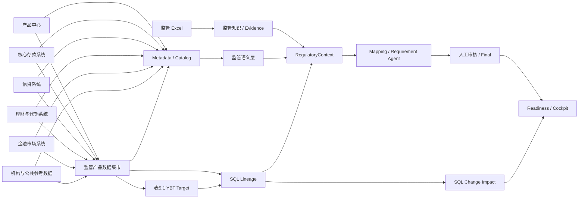

# 一表通监管数据智能平台：产品表 5.1 演示与使用手册

> 验证基线：`origin/main` / `b31faea8e3b5f20fea36a736d0290edf1aeebb7d`
>
> 监管来源：`C:\Users\李儒伟\Desktop\5_1产品表 - 副本.xlsx`
>
> Excel SHA-256：`451D5BB9F39DBE43B6DD2D1AAB84801C265A915E4B13C37C5E3967021F8C2DFC`
>
> 数据生成种子：`20260830`
>
> 本手册记录的是 2026-08-30 本地真实运行与浏览器 UAT 结果。

## 1. 项目是什么

一句话定位：这是一个把监管 Excel、银行数据资产、监管语义、SQL 血缘、证据和人工治理连接起来的监管数据智能平台。

银行收到《表 5.1 产品业务基本信息》后，底层通常没有一张现成表可以直接报送。产品编号、期限、币种、状态、发行机构等信息分散在产品中心、核心存款、信贷、理财代销、金融市场和公共参考系统中。本项目建立 Source → Regulatory Mart → YBT Target 的双层数据链路，并让需求、映射、语义、证据和后续 SQL 变更处于同一治理闭环。

它不是普通 AI 文档生成器：AI 只能在受治理的 RegulatoryContext 上工作；AI Draft 与 Human Final 分离；结果必须能回到监管条目、数据字段和 SQL。当前演示环境的 LLM Runtime 为 Mock，因此本轮没有伪造生成结果，而是明确标记为 `BLOCKED_LLM_RUNTIME`。

## 2. Demo 背景

监管对象是《表 5.1 产品业务基本信息》，采集范围覆盖填报机构经营活动中的产品和业务，包括存款、贷款、债券、理财、保险、卡、自营、代理代销及投融资业务。

本次直接解析用户提供的 Excel，并保留其中 17 个正式监管字段：

| 编码 | 字段 | 编码 | 字段 |
| --- | --- | --- | --- |
| E010001 | 产品ID | E010002 | 机构ID |
| E010003 | 产品名称 | E010004 | 产品编号 |
| E010005 | 科目类型 | E010007 | 产品类别 |
| E010008 | 自营标识 | E010009 | 产品币种 |
| E010010 | 产品期限 | E010011 | 产品成立日期 |
| E010012 | 产品到期日期 | E010013 | 产品期次 |
| E010014 | 利率类型 | E010015 | 产品状态代码 |
| E010018 | 代客产品所属机构名称 | E010016 | 备注 |
| E010017 | 采集日期 |  |  |

Excel 中的“字段业务定义（监管原始口径）”和“字段业务定义（监管定义细化）”作为 Regulatory Knowledge 原文导入。Demo 增加的解释只作为 `Bank Internal Interpretation` 展示，不冒充监管原文。Excel 还包含停用日期、归属部门、产品线、产品类、产品组、基础产品、客群、渠道、区域、合作方、额度、配套制度和后评价时间等内部补充属性，这些进入 Mart 或内部扩展层，不冒充正式监管字段。

## 3. Demo 银行数据架构



已验证的链路包括数据构建、7 个数据源注册与连接测试、元数据同步、Catalog、Knowledge、Semantic、Target/Scenario、双层 Mapping 任务、SQL 解析、Lineage、Impact、Reporting Cycle 和 Cockpit。真实 Agent 生成因运行时阻塞而未执行。

## 4. 六个源系统分别模拟什么

| 数据库 | 业务系统 | 主要表 | 主要数据 | 规模 |
| --- | --- | --- | --- | ---: |
| `src_product_center.db` | 企业级产品中心 | `product_master`、层级、渠道、区域、客群、合作方、制度、评价 | 统一产品主数据及内部补充属性 | 1,280 个产品；12 张表 |
| `src_core_deposit.db` | 核心存款 | `deposit_product`、利率、币种、期限、账户类型 | 单位/个人活期、定期、通知、保证金、结构性存款 | 340 个产品；5 张表 |
| `src_credit_loan.db` | 信贷 | `loan_product`、利率、额度、客群、抵押、用途 | 流贷、固贷、住房、消费、经营、票据、法人账户透支 | 370 个产品；6 张表 |
| `src_wealth_agency.db` | 理财与代销 | 理财、基金、保险、代销、发行人、协议、份额类别 | 理财 160、基金 90、保险 60，含自营/代客和 A/C 份额 | 310 个专业域产品；7 张表 |
| `src_treasury_market.db` | 金融市场 | 债券、同业、货币市场、央行业务、证券标识 | 债券、债券借贷、同业、存放央行、央行借款 | 180 个产品/业务；5 张表 |
| `src_reference.db` | 机构与公共参考 | 机构、部门、币种、科目、渠道、区域、客群、产品类别字典 | 总行、分行、支行/最小经办机构及公共码表 | 25 个机构；8 张表 |

此外生成 80 个卡及其他业务记录。总产品数为 1,280。受控异常 50 条，占 3.91%，包括 issuer 缺失、停用日期缺失、状态冲突、期限不一致、非法类别、币种缺失、重复编号和法人账户透支解释冲突等。异常是确定性生成并记录预期行为，不是随机噪声。

## 5. 监管集市

`mart_regulatory.db` 是独立监管集市，不让源系统直接映射最终报表。实际生成：

| Mart 表 | 行数 | 用途 |
| --- | ---: | --- |
| `mart_product_master` | 1,280 | 统一产品主档和核心监管属性 |
| `mart_product_attribute` | 1,280 | 产品扩展属性 |
| `mart_product_hierarchy` | 1,280 | 产品线/类/组/基础产品 |
| `mart_product_scope` | 1,280 | 客群和适用范围 |
| `mart_product_channel` | 1,280 | 渠道 |
| `mart_product_region` | 1,280 | 区域 |
| `mart_product_partner` | 142 | 合作方/发行机构 |
| `mart_product_policy` | 1,280 | 配套制度 |
| `mart_product_lifecycle` | 1,280 | 成立、到期、停用和采集周期 |
| `mart_product_regulatory_classification` | 1,280 | 监管产品分类 |
| `mart_product_quality_issue` | 50 | 受控异常清单 |
| `mart_source_record_reference` | 2,480 | Mart 到源记录引用 |
| `mart_product_snapshot` | 2,560 | 2026-07 / 2026-08 两期状态 |
| `ybt_5_1_product_business_basic` | 1,280 | 17 个正式监管字段的最终 Target |

Source → Mart 使用 `demo/product_5_1/sql/source_to_mart/build_mart_product.sql`；Mart → YBT v1/v2 使用 `demo/product_5_1/sql/mart_to_regulatory/` 下的真实 SQL。SQL 包含 JOIN、CASE、COALESCE、字典转换、日期逻辑和状态映射，可被当前 SQLGlot/Lineage 能力解析。

## 6. 表 5.1 字段映射

下表来自 `expected/golden_mapping.json`。它是 **Evaluation Oracle**，只允许在 Agent 完成后比较，bootstrap、RegulatoryContext 和 Generator 均禁止读取。当前不是 Agent 生成结果。

| 监管字段 | Mart | 主要 Source | Transformation | Semantic | Evidence |
| --- | --- | --- | --- | --- | --- |
| E010001 产品ID | `master.product_id` | 产品中心/专业域内部 ID | 理财登记编码风格，其余内部编号；全局唯一 | ProductIdentifier | Excel 字段口径 |
| E010002 机构ID | `master.institution_id` | 产品中心 + 机构字典 | 最小经办机构；跨地区用共同上级 | ReportingInstitution | Excel 字段口径 |
| E010003 产品名称 | `master.product_name` | 产品中心 | 产品中心全称优先 | Product | Excel 字段口径 |
| E010004 产品编号 | `master.product_number` | 产品中心/专业系统 | 标准产品市场代码，否则行内编号 | ProductIdentifier | Excel 字段口径 |
| E010005 科目类型 | `master.accounting_subject_type` | 产品中心 + 科目字典 | 映射 00/01/02/06；法透保留开放问题 | AccountingSubjectType | Excel 原文/细化 |
| E010007 产品类别 | `classification.product_category` | 产品类型 + 专业分类 + 类别字典 | 按业务实质映射；多值半角分号 | ProductCategory | Excel 类别字典 |
| E010008 自营标识 | `master.proprietary_flag` | 产品中心/代销系统 | 01 自营、02 代客、03 混合 | ProprietaryProductFlag | Excel 字段口径 |
| E010009 产品币种 | `master.currency` | 专业域币种 + 币种字典 | 三位字母；多币种分号；ALL/WB | Currency | Excel 字段口径 |
| E010010 产品期限 | `master.product_term` | 生命周期、成立日、到期日 | 持续性=0；一次性=到期日-成立日 | ProductTerm | Excel 原文/细化 |
| E010011 产品成立日期 | `master.establishment_date` | 产品中心上线日 | YYYY-MM-DD；按细化口径处理不可追溯情况 | ProductLifecycle | Excel 字段口径 |
| E010012 产品到期日期 | `master.maturity_date` | 产品中心/专业系统 | 持续性=9999-12-31；一次性取约定日 | ProductLifecycle | Excel 原文/细化 |
| E010013 产品期次 | `master.product_issue` | 产品中心/理财 | 不涉及可空；取计划总期次或最新期次 | ProductIssue | Excel 字段口径 |
| E010014 利率类型 | `master.interest_rate_type` | 存款/贷款利率规则 | 01 固定、02 浮动、03 固定或浮动 | InterestRateType | Excel 字段口径 |
| E010015 产品状态代码 | `master.product_status_code` | 产品中心 + 专业系统 | active→01，inactive→02；v2 增加专业系统停用优先 | ProductStatus | Excel 字段口径 |
| E010018 代客产品所属机构名称 | `master.agency_institution_name` | 代销产品 + issuer | 仅 02 代客产品填报 | AgencyInstitution | Excel 字段口径 |
| E010016 备注 | `master.remark` | 质量/跨系统比对 | 多说明使用半角分号 | Product | Excel 字段口径 |
| E010017 采集日期 | `master.collection_date` | ETL 周期 | 本 Demo 正式周期 2026-08-31 | ProductLifecycle | Excel 字段口径 |

## 7. 系统详细使用方法

以下路径和页面状态来自真实浏览器 UAT，不是根据代码推测。

1. 登录：访问 `http://127.0.0.1:3000/login`，使用本地 Demo 管理员登录。成功后项目自动选择“一表通产品数据智能演示”。密码只通过环境变量提供，不写入仓库。
2. 项目：确认 AppShell 当前项目为“一表通产品数据智能演示”，银行为“华东示例银行”。
3. 数据源：进入 `/datasources`，看到 7 个 SQLite 数据源。点击“测试”，实际返回“连接、认证与元数据权限检查通过”。
4. 元数据同步：在数据源页执行同步。已验证 7/7 completed，合计 7 个 schema、57 张表、312 个字段。
5. 数据目录：进入 `/catalog`，可以浏览产品中心、五个专业/参考源库和监管 Mart；已导入 183 个 Source Field 与 112 个 Mart Field。
6. 监管知识：进入 `/knowledge/documents`，看到 Excel 状态为 indexed，1 份文档、32 个知识单元。页面明确显示 Mock 模式和 Milvus 未就绪。
7. 语义目录：进入 `/semantics`，看到 14 个概念和 128 个绑定。当前概念/绑定状态为 `ai_suggested`，尚未经过正式批准。
8. Requirement Workspace：进入 `/fields`，看到 17 个字段、13 个场景。点击 E010010 后进入 `/fields/9/scenarios`，可看到监管原始定义、监管定义细化和独立的 Bank Internal Interpretation。Workspace API 返回 17 条 records。
9. AI 生成：字段场景页的 AI 草稿按钮在当前 Mock LLM 下不可用。正确演示话术是“运行时阻塞，系统没有生成假草稿”，而不是展示预置答案。
10. Evidence：监管知识已经索引，RegulatoryContext 对重点字段返回 30–32 条 Knowledge Evidence；由于生成未运行，没有 AI 结论到证据引用的最终闭环。
11. Lineage：进入 `/lineage`，看到 2 份脚本、节点列表、未完成影响；再进入 `/lineage/scripts` 查看 Source→Mart v1 和 Mart→YBT v2。UI 端点单页显示上限为 200 个节点，验证 API 总量为 228 节点、169 边、69 个 unresolved。
12. Review：当前没有真实 AI Draft，因此不得演示 AI Draft→Human Edit→Final 已完成。Impact workflow 自动产生 3 个 pending task，但不是字段内容审核完成。
13. Quality：进入 `/quality`，看到 10 条 draft expectation。页面文字明确说明这是规则配置，不是执行结果；当前没有质量执行引擎。
14. Deliverable：进入 `/deliverables`，当前正式包为 0，创建动作不可用，因为没有正式模板且 readiness 有 blocker。
15. Impact：进入 `/lineage/changes/3` 查看 v1→v2 critical diff，再进入 `/lineage/impacts/3` 查看真实影响传播和 3 个待办。
16. Dashboard：进入 `/cockpit`，机构驾驶舱可用，显示 1 个项目及治理风险。`/projects/1/dashboard` 在本次 UAT 中前端失败，虽然后端两个请求均返回 200；这是 P1 Finding，不应在演示中掩盖。

## 8. 一次完整 Demo 演示脚本

### 5 分钟快速版

1. “监管给了银行表 5.1，但银行没有一张现成的表。数据散落在六类系统。”展示架构图。
2. 打开 `/datasources`：“这里是 7 个真实 SQLite 数据源，6 个 Source 加 1 个监管 Mart，连接测试和元数据同步都由平台执行。”
3. 打开 `/catalog`：“57 张表、312 个字段进入 Catalog，平台先理解数据资产。”
4. 打开 `/knowledge/documents` 和 `/semantics`：“Excel 监管定义成为知识证据；语义层统一 product_code、loan_prod_cd 等异构叫法。”
5. 打开 E010010 字段场景：“产品期限的监管原文是持续性填 0、一次性填成立至到期天数；内部解释与监管原文严格分栏。”
6. 打开 `/lineage/changes/3` 和 `/lineage/impacts/3`：“SQL v2 改变停用状态优先级，平台发现 18 个 Mart 字段、17 个 Mapping、13 个语义概念受影响，并创建 3 个审核任务。”同时坦诚说明 Target Field/Requirement 传播尚未打通。
7. 打开 `/cockpit`：“驾驶舱显示真实治理状态：准备度 39.13%，4 个关键阻塞项，而不是硬编码漂亮数字。”
8. 收尾：“本地 AI Runtime 目前是 Mock，所以系统拒绝伪造 Agent 结果；这也是当前进入下一阶段的首要阻塞。”

### 15 分钟正式版

1. 用 1 分钟解释监管业务背景和 17 个字段。
2. 用 2 分钟展示六个源系统、1,280 个产品、50 条受控异常和独立 Mart。
3. 用 2 分钟在 `/datasources`、`/catalog` 展示真实连接、57 张表和 312 个字段。
4. 用 2 分钟在 Knowledge/Semantic 页面讲监管原文、Evidence、14 个语义概念和 128 个绑定，并说明它们仍待治理确认。
5. 用 2 分钟打开 E010010 场景，逐层讲监管原文、Bank Internal Interpretation、Mart 字段、源字段和 SQL 规则。
6. 用 1 分钟说明 RegulatoryContext 对重点字段聚合 35–37 个 facts，但可信 semantic/mapping 为 0 的原因是当前对象仍为 `ai_suggested`/未批准。
7. 用 1 分钟展示 Quality 10 条 expectation，并强调不是执行结果。
8. 用 2 分钟演示 v1→v2、critical impact、18 个 Mart 字段、13 个语义概念和 3 个 ReviewTask，同时指出 Target/Requirement 传播缺口。
9. 用 1 分钟展示 `/cockpit` 的准备度和风险；说明项目 Dashboard 的 P1 前端问题。
10. 用最后 1 分钟总结已验证能力、`BLOCKED_LLM_RUNTIME`、产品成熟度和下一阶段关闭项。

## 9. Agent 实际运行结果

| 指标 | 结果 | 说明 |
| --- | --- | --- |
| 正式字段数 | 17 | 全部进入 Target/Scenario/Mapping Task 初始化 |
| LLM Runtime | `BLOCKED_LLM_RUNTIME` | provider=`mock`，model=`mock-llm` |
| Embedding / Vector | Mock / Mock | Knowledge 可索引，但不是正式 Milvus 向量运行时 |
| AI Mapping / AI Requirement | 未生成 | 验证脚本没有调用 Generator |
| Target→Mart Accuracy | N/A | 无真实 AI 输出，不能计算 |
| Mart→Source Accuracy | N/A | 无真实 AI 输出，不能计算 |
| Transformation Accuracy | N/A | 无真实 AI 输出，不能计算 |
| Evidence Citation Accuracy | N/A | 无真实 AI 输出，不能计算 |
| Semantic Match Accuracy | N/A | 无真实 AI 输出，不能计算 |
| Hallucinated Asset Count | N/A | 没有生成，不等于 0 |
| Missing Required Source Count | N/A | 没有生成，不能计算 |
| Open Question Precision | N/A | 没有生成，不能计算 |
| 人工修改数量 | N/A | 没有 AI Draft，未走人工内容审核 |

RegulatoryContext 已实际执行。重点字段返回 35–37 个 facts、30–32 条 Knowledge Evidence、4 条 raw lineage fact、1 条 metadata fact 和 4 个 open question。可信 Semantic/Mapping fact 为 0，因为语义对象仍为 `ai_suggested`，映射尚未批准；这是真实治理状态，不应被修饰。

## 10. 实际字段案例：E010010 产品期限

监管原文：

> 描述产品本身的期限。一次性产品填写产品从成立至到期的持续天数。持续性产品填写0。如银行机构本身存款类产品应为持续性产品，如一年期债券类产品应为一次性产品。

监管定义细化还明确：单次发售的一期大额存单类似单只债券，示例应按产品实际期限填报，而不是按销售窗口时长填报。

实际链路设计：

```text
监管 Excel E010010
  ↓ Knowledge Evidence（本次检索 31 条）
Semantic: PRODUCT_TERM（当前 ai_suggested）
  ↓
Mart: mart_product_master.product_term
  ↓
Source: lifecycle_type + launch_date + maturity_date
  ↓
SQL: continuous → 0；one_off → julianday(maturity_date)-julianday(establishment_date)
  ↓
YBT: ybt_5_1_product_business_basic.product_term
```

Bank Internal Interpretation：内部实现将持续经营型存款产品归为 `continuous`；单只债券、单期大额存单等归为 `one_off`，按约定成立/到期日计算。该解释必须接受业务审核，不能覆盖监管原文。

Agent Requirement、AI Evidence Citation 和 Human Final：本轮均未生成/未确认，因为 LLM Runtime 被阻塞。Golden Mapping 中的上述链路只用于后验评估，不是 AI 成果。

## 11. SQL Change Impact 案例

Mart→YBT v1 按产品中心状态映射 E010015；v2 增加“专业业务系统已经停用时优先报送 02”的规则。这是合理的业务规则调整，不是语法错误。

实际平台结果：

```text
Script Version 1 → 2
  ↓ 9 个 change item，severity=critical
Lineage：228 nodes / 169 edges / 69 unresolved
  ↓
18 个 Mart Field
17 个 Source→Mart Mapping
13 个 Semantic Concept
  ↓
0 个 Target Field（产品缺口）
0 个 Requirement（产品缺口）
  ↓
3 个 pending ReviewTask
```

因此“SQL 变化→Mart/Mapping/Semantic→审核任务”已成立；“→Target Field→Regulatory Requirement”的完整闭环尚未成立。平台没有把这个缺口包装为成功。

## 12. Databricks Data Intelligence 理念如何落地到本项目

本项目借鉴的不是品牌界面，而是以治理上下文驱动智能的工作方式：

```text
Data → Metadata → Semantic → Context → Intelligence → Action
```

1. AI 不直接读取裸数据库。裸库只有列名和数据类型，缺少监管含义、业务边界、可信状态和来源等级。平台先通过 Metadata/Catalog 纳管资产。
2. Semantic Layer 统一异构叫法。例如 `product_code`、专业系统产品号和市场代码都可以受治理地关联“产品编号”，而不是让模型凭字符串猜测。
3. RegulatoryContext 将监管知识、Metadata、Semantic、Lineage、Evidence、Quality、Conflict 和 Open Question 组合成有来源的事实集合。
4. Lineage 让映射和需求能回到 Source、SQL Expression、Mart 和 Target，也让生产 SQL 变化可以重新定位影响面。
5. Metric/Cockpit 使用治理服务的真实统计口径。本次 readiness=0.3913、blocked，来自项目事实，不是截图硬编码。
6. Action 是人工治理和 ReviewTask。AI 只生成 Draft；业务、技术和最终审核决定正式口径。当前 Agent 未运行，所以没有声称这一环已完成。

## 13. 项目技术架构

| 层 | 最新代码中的实际技术 | 本次 Demo 状态 |
| --- | --- | --- |
| Frontend | Next.js 14.2、React 18.3、TypeScript 5.7、Tailwind CSS 3.4、TanStack Query 5、Lucide React | 本地 Next dev；没有 ECharts 依赖 |
| Backend | FastAPI、Pydantic Settings、SQLAlchemy 2、Alembic | 本地运行正常 |
| Database | SQLite 开发/Demo；PostgreSQL 16 + psycopg 为生产路径 | 本次平台 DB 与 7 个数据源均为 SQLite |
| Queue | Celery 5 + Redis 7 为生产路径 | 本次 Redis disabled；任务队列健康为本地模式 |
| Vector | Milvus 2.5 可选，`pymilvus` 客户端 | 本次 disabled/mock |
| Embedding | FastEmbed 本地服务、OpenAI-compatible 接口 | 本次 `mock-embedding` |
| Retrieval | Keyword + Vector Hybrid Retrieval | 正式向量路径未就绪 |
| LLM | OpenAI-compatible、本地 vLLM/Ollama-compatible provider | 本次 `mock-llm`；没有运行 Qwen |
| SQL Parser | SQLGlot 25–27 | 两份 SQL 脚本解析成功 |
| Governance | Scenario、Mapping、Evidence、Review Workflow、QualityExpectation、Deliverable、UAT | 初始化与部分治理事实可用；人工内容闭环未完成 |
| Analytics | Metric Registry、Reporting Cycle、Project Analytics、Institution Cockpit | Cockpit 可用；Project Dashboard 有 P1 UI 缺陷 |

## 14. 项目的技术亮点

技术面试：重点讲确定性多源数据工程、Source→Mart→Target 双层映射、SQLGlot 字段级血缘、受治理 RegulatoryContext、Golden Oracle 与 Agent Context 隔离，以及发现阻塞后拒绝制造指标。

产品汇报：重点讲监管 Excel 如何升级为可检索知识资产，17 个字段如何关联 13 个业务场景，SQL 变化如何产生真实影响与审核任务，以及 Cockpit 为什么显示阻塞而不是虚假“全部就绪”。

内部领导：重点讲跨部门协同和风险可见性。业务定义、技术血缘、证据、审核状态和变更影响集中在一个平台，减少“表格版本、口径解释和生产脚本各自为政”。

已经真实验证的亮点：

- 1,280 个银行风格产品、六类源系统、独立监管 Mart 和 3.91% 受控异常可重复生成。
- 真实监管 Excel 经 Knowledge 入口索引为 32 个知识单元。
- 7 个数据源通过平台 API 注册，7/7 连接测试和 Metadata Sync 成功。
- 真实 SQL 形成 Script Version、Lineage、ChangeSet、Impact 和 ReviewTask。
- Golden Truth 与 Agent Context 代码路径隔离，避免向模型泄漏标准答案。
- Mock LLM 下主动阻塞生成，证明系统没有为 Demo 伪造 AI 成果。

## 15. 系统目前存在的问题

### P0

| ID | 现象与影响 | 复现 | 推荐修改 |
| --- | --- | --- | --- |
| P0-01 | `BLOCKED_LLM_RUNTIME`。无法运行真实 Mapping/Requirement Generator、Agent Evaluation 和三字段人工治理闭环。 | 查看运行时状态：LLM/Embedding/Vector 均为 mock；字段页生成按钮不可用。 | 配置可用的本地或 OpenAI-compatible LLM、正式 embedding 和 Milvus；连接测试后重跑 verification/evaluation。 |
| P0-02（已修复） | bootstrap 创建大量 semantic binding 时收到 HTTP 429，首次运行中断。 | 原始 bootstrap 连续请求触发限流。 | 已在 Demo API client 中按 `Retry-After`/指数退避进行受控重试，并验证可幂等恢复。 |

### P1

| ID | 现象与影响 | 复现 | 推荐修改 |
| --- | --- | --- | --- |
| P1-01 | Project Dashboard UI 显示“无法加载”，但 `/api/projects/1/dashboard` 与 `/analytics/overview` 均返回 200；影响项目驾驶舱演示。 | 登录后访问 `/projects/1/dashboard`，等待 3.5 秒仍为空/加载态。 | 检查前端响应解包、schema 判断和 Query 状态；增加 200 payload 的组件测试。 |
| P1-02 | SQL Impact 停在 Mart/Mapping/Semantic，Target Field 与 Requirement 都为 0。 | 打开 `/lineage/impacts/3`。 | 补齐 raw SQL lineage node 与受治理 TargetField/Requirement 的标识解析和传播边。 |
| P1-03 | 重点 Target Field lineage API 返回 0 node/edge，而原始脚本图存在链路。 | verification 查询 E010005/E010007/E010010/E010012/E010015/E010018。 | 统一 Target Field identity 与 script parser 产出的 target node key。 |
| P1-04 | 14 个概念/128 个绑定仍为 `ai_suggested`，可信 RegulatoryContext 不纳入这些事实。 | 查看 `/semantics` 和 Context summary。 | 增加批量治理确认/审核流程，再以 approved 状态重建 Context。 |
| P1-05 | 69 个 unresolved lineage node，降低影响分析完整性。 | `/lineage` 或 verification summary。 | 改进 SQL 名称解析、catalog identity 对齐和跨库限定名处理。 |
| P1-06 | 重复 Metadata Sync 累积 369 个 Schema Drift 事件，疑似把未变化重发现也计为 drift。 | Cockpit 风险分布。 | 基于结构 hash/版本差异去重，仅记录真实 schema 变化。 |

### P2

| ID | 现象与影响 | 复现 | 推荐修改 |
| --- | --- | --- | --- |
| P2-01 | Reporting Cycle 已创建，但 snapshot 状态仍显示不可用。 | 查看两期 cycle 的 analytics snapshot 状态。 | 将 `mart_product_snapshot` 与 cycle snapshot service 建立正式关联。 |
| P2-02 | 多个开发页面可见 Next dev error indicator（1 或 3 errors），页面主体仍可渲染。 | 浏览 UAT 页面右下角。 | 捕获 browser console/source map 错误并消除；生产 build 后再做一次 UAT。 |
| P2-03 | Quality 只有 Expectation，没有 Execution Engine。 | `/quality`。 | 实现可审计的规则执行、结果实例和 cycle 绑定；此前不得展示质量得分。 |
| P2-04 | 没有正式 Deliverable Template，交付包为 0。 | `/deliverables`。 | 配置受版本治理的正式模板，并在 readiness 关闭后验证生成。 |

## 16. 当前产品成熟度

**Internal Product**。

理由：核心领域模型、数据源、Catalog、Knowledge、Semantic、Lineage、Impact、Cockpit、权限和治理框架已经形成可运行产品；本次真实监管场景能够暴露并保存真实缺口。但正式 AI Runtime 未接通，Agent Evaluation 和人工内容闭环未完成，Target/Requirement 影响传播、Project Dashboard、Quality Execution、Deliverable 和正式向量运行时仍有缺口，因此尚不能称为 UAT Ready 或 Production Candidate。

## 17. 下一阶段建议

1. 先配置真实 LLM、Embedding、Milvus，重跑全部 17 字段 Generator；逐字段生成 evaluation artifact，严禁复用 Golden Oracle 作为 Context。
2. 修复 Impact 到 TargetField/Requirement 的传播和 Target Field lineage identity，关闭 P1-02/P1-03 后重演 v1→v2。
3. 完成 Semantic/Mapping 治理确认，再比较 RegulatoryContext 中 trusted facts 的变化。
4. 修复 `/projects/1/dashboard` 的前端 200 响应处理，并用生产 build 做真实浏览器回归。
5. 审计 Schema Drift 去重逻辑和 69 个 unresolved node。
6. 实现 Quality Execution 或继续在 UI 明确标注“Expectation only”；不得将规则数量当作质量分。
7. 配置正式 Deliverable Template，等 Agent 与审核闭环完成后再验证交付包。
8. 使用真实 Agent 结果选择高置信度、人工修改、Open Question 各一个字段，完成 Business→Technical→Final Review，并证明 Human Final 不被 AI 覆盖。

## 附录 A：可重复运行

在仓库根目录执行：

```powershell
backend\.venv\Scripts\python.exe scripts\demo\build_product_5_1_demo.py --regulatory-xlsx "C:\Users\李儒伟\Desktop\5_1产品表 - 副本.xlsx"

$env:PRODUCT_5_1_ADMIN_PASSWORD='Product5_1-Demo-20260830!'
backend\.venv\Scripts\python.exe scripts\demo\bootstrap_product_5_1_platform.py --regulatory-xlsx "C:\Users\李儒伟\Desktop\5_1产品表 - 副本.xlsx"
backend\.venv\Scripts\python.exe scripts\demo\run_product_5_1_verification.py
```

运行时产物位于 `.demo_runtime/product_5_1/`，平台验证摘要为 `platform_verification_summary.json`。

## 附录 B：安全重置

```powershell
backend\.venv\Scripts\python.exe scripts\demo\reset_product_5_1_demo.py --dry-run
backend\.venv\Scripts\python.exe scripts\demo\reset_product_5_1_demo.py --execute --confirm-project-name "一表通产品数据智能演示"
```

默认 dry-run。执行模式要求精确项目名确认，只删除明确的 Demo runtime 文件并保留未知文件。由于当前平台没有 project delete API，脚本不会直接修改平台业务数据库或删除其他项目；Demo 项目容器会保留供下一次 bootstrap 幂等复用。
