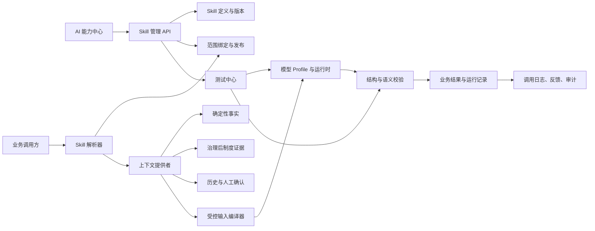
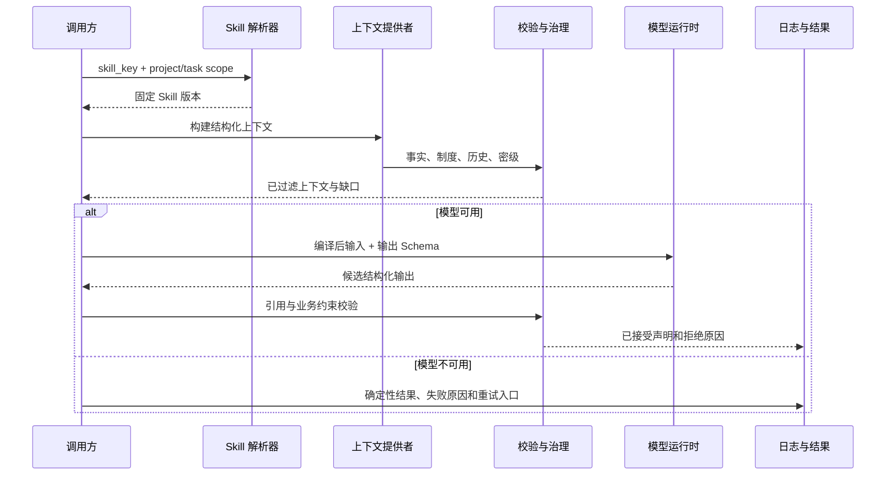

# AI Skill 配置中心详细设计

- 文档状态：设计基线，待评审
- 适用范围：智能分析智能体平台全部模型辅助能力
- 首期落地对象：`lineage_edge_explanation`（血缘关系业务解释）
- 设计原则：复用现有模型、知识治理、权限、审计和评测能力，不另建平行 AI 平台

## 1. 结论

用户提出的“是否类似生成特定 Skill”判断方向正确，但不建议把文件系统中的 `SKILL.md` 原样搬进业务平台。业务系统需要的不是一个可任意加载的文件，而是一份可审计、可测试、可发布、可回滚的任务执行契约。

因此，本设计把 AI Skill 定义为：

> 面向一个明确业务任务，由版本化的输入契约、上下文装配、提示词、模型策略、输出结构、校验规则、测试集和发布范围共同组成的可执行配置包。

它回答的不是“给模型一段什么话”，而是：

1. 这项任务在什么业务场景执行；
2. 系统向模型提供哪些经过权限和有效性过滤的事实；
3. 哪些内容由确定性程序生成，模型不得改写；
4. 模型必须按什么结构输出；
5. 每个结论必须引用哪类证据；
6. 哪一种结果算通过，哪一种结果必须降级或人工确认；
7. 哪个机构、项目或任务使用哪个固定版本；
8. 修改后如何测试、审批、发布、观测和回滚。

## 2. 目标与非目标

### 2.1 目标

1. 在系统中可视化查看、编辑、测试、发布和回滚 AI 能力，不要求修改代码。
2. 将血缘业务解释等能力的提示词、输入范围、模型策略、输出契约和测试样例统一管理。
3. 让同一项能力可以按平台、机构、项目、任务逐级覆盖，并保持机构和项目隔离。
4. 每次模型调用都能追溯到 Skill 版本、上下文哈希、模型 Profile、知识版本和人工反馈。
5. 通过测试中心和发布门禁降低“改 Prompt 后局部变好、全局变差”的风险。
6. 模型不可用时继续返回确定性事实和明确缺口，不丢失业务数据。
7. 保持现有 API、路由、Prompt 版本、模型 Profile 和 RAG 评测流程向后兼容。

### 2.2 非目标

1. 不允许在页面执行 SQL、Shell、Python、存储过程或任意脚本。
2. 不允许把 API Key、数据库密码、JWT 或 SSH 凭据放入 Skill 配置。
3. 不允许 Skill 绕过现有知识有效性、权限、数据密级和审计规则。
4. 不允许模型自动确认监管要求、人工口径或正式交付版本。
5. 不允许将文件系统 Skill、任意 Prompt 文件或插件直接上传后执行。
6. 首期不建设通用工作流编排器；模型无工具调用权限，所有事实由平台服务预先获取。

## 3. 现状核验

### 3.1 已有能力

平台已经具备 AI 运行和治理所需的大部分基础设施：

| 能力 | 现有实现 | 可复用方式 |
| --- | --- | --- |
| 模型连接 | `ModelProfile`、`backend/app/api/ai_runtime.py` | 作为 Skill 的模型连接和执行参数来源 |
| Prompt 版本 | `PromptTemplateVersion` | 保存已发布 Skill 的低层提示词快照，兼容旧调用 |
| 结构化输出 | Pydantic 输出模型、`execute_runtime_chat` | Skill 输出继续使用严格 Schema 校验 |
| RAG 评测 | `RagEvaluationCase`、`RagEvaluationRun`、`RagEvaluationResult` | 扩展为更通用的 Skill 测试和评分基础 |
| 用户反馈 | `AIUserFeedback` | 关联 Skill 版本和具体运行记录 |
| 调用观测 | `ModelCallLog`、`RetrievalLog` | 增加 Skill 版本、上下文哈希和评测运行关联 |
| 知识治理 | 检索、有效版本、作用域和密级控制 | Skill 只消费治理后的制度证据 |
| 血缘解释 | `backend/app/services/lineage/explanation.py` | 作为首个纵向试点任务 |
| 权限与审计 | `PermissionService`、审计服务 | 控制配置、测试、发布和跨机构访问 |

### 3.2 部分具备

1. Prompt 已经有版本号和启用状态，但没有 Skill 范围绑定、发布审批、差异比较和回滚流程。
2. 模型 Profile 已经能配置供应商、模型、上下文长度和连接测试，但模型选择尚未按任务和范围绑定。
3. RAG 评测已经具备召回率、引用覆盖、答案忠实度等指标，但测试对象是知识问答，尚不能测试任意结构化任务。
4. 模型调用日志已经记录 `prompt_key` 和 `prompt_version`，但尚未记录完整 Skill 版本、输入契约版本和测试运行。
5. 血缘解释已经做到“事实优先、模型失败可降级”和输出事实引用校验，但输入主要是单条边和基础事实。

### 3.3 当前缺口

1. `frontend/app/prompt-versions/page.tsx` 只把接口返回值以 JSON 文本展示，没有编辑、测试、发布、差异和回滚操作。
2. `GET /prompt-versions` 当前没有权限检查，不应在补充管理能力前直接扩大数据暴露面。
3. `PromptTemplateVersion` 没有机构、项目、任务作用域，也没有发布状态和生效时间。
4. 通用运行时 `execute_runtime_chat` 接收的是各业务服务已经拼好的 `input_text`；虽然运行时读取了 `user_prompt_template`，但该通用路径没有统一渲染该模板。因此当前页面即使修改模板，也不能保证业务调用会按预期变化。
5. 现有评测模型围绕 RAG 答案设计，缺少通用断言、Mock/真实模型区分、回归对比和发布门禁。
6. 血缘解释当前输入没有完整纳入多跳路径、明确制度条款、字段约束、码值、质量画像、脚本差异和此前人工确认结果，因此解释容易停留在“从 A 到 B”的泛化描述。
7. 当前没有“Skill 变更影响哪些调用方、需求或固定交付”的正式关系表。

## 4. 产品定义与核心决策

### 4.1 Skill 不是一段 Prompt

一个 Skill 由六层组成：

1. **任务定义**：业务目标、调用场景、责任域、适用用户。
2. **上下文契约**：允许读取的数据、上下文提供者、上限和脱敏等级。
3. **推理指令**：系统提示词、任务模板、允许引用的事实和禁止事项。
4. **模型策略**：模型 Profile、温度、输出预算、超时、重试和降级。
5. **输出契约**：JSON Schema、证据引用、冲突、缺口、置信度和人工确认要求。
6. **质量门禁**：测试样例、断言、指标阈值、评测结果和发布审批。

### 4.2 确定性事实与模型解释分层

系统必须始终保持以下顺序：

1. 解析器、元数据服务、路径解析器和知识治理服务生成事实；
2. 校验器为每条事实分配稳定 ID 和来源；
3. 模型只负责解释、归纳、发现差异和组织语言；
4. 输出校验器拒绝未知事实、未知条款和无依据结论；
5. 人工决定是否采纳为业务口径或需求内容。

模型不能创建新的表、字段、路径、监管条款或人工确认状态。脚本中存在某个逻辑，也不能自动升级为监管要求。

### 4.3 配置可以开放，安全边界不能开放

用户可以修改提示词、模型策略、上下文范围、测试样例和输出说明，但以下内容只能由平台管理员在受控条件下调整：

- 任务唯一标识和调用入口；
- 事实与制度证据的最低引用规则；
- 禁止执行代码、SQL 和工具调用的安全规则；
- 机构和项目隔离规则；
- 数据密级、外部模型和脱敏规则；
- 输出 Schema 中的证据字段和必填状态；
- 发布、审计和回滚机制。

### 4.4 已发布版本不可变

草稿可以反复编辑；一旦发布，版本内容和输入契约即冻结。修改必须创建新草稿。回滚采用“创建新版本，内容引用旧版本”的方式，不直接改写历史版本和历史调用记录。

### 4.5 不静默截断证据

上下文超过预算时必须显示占用明细并提供三种选择：缩小范围、提高预算或阻断执行。不得悄悄删除后半段制度、路径或字段事实后继续调用模型。

## 5. 角色与权限

| 角色 | 可查看 | 可编辑草稿 | 可运行测试 | 可发布 | 适用范围 |
| --- | --- | --- | --- | --- | --- |
| 平台管理员 | 全部 | 是 | 是 | 平台级 Skill | 全局 |
| 机构管理员 | 本机构及授权项目 | 是 | 是 | 机构级 Skill | 本机构 |
| 项目管理员 | 本项目 | 是 | 是 | 项目级 Skill，需按策略审批 | 本项目 |
| AI 评测员 | 被授权 Skill 和测试集 | 可维护测试集 | 是 | 否 | 被授权范围 |
| 业务审核人 | 已发布 Skill、运行证据和差异 | 否 | 可执行受控样例 | 可审批业务口径 | 被授权范围 |
| 普通业务用户 | 当前项目已发布 Skill 的解释及来源 | 否 | 否 | 否 | 当前项目 |

建议新增项目权限：

- `ai_skill.view`
- `ai_skill.edit_draft`
- `ai_skill.test`
- `ai_skill.publish_project`
- `ai_skill.manage_scope`
- `ai_skill.approve`
- `ai_skill.view_call_details`

机构级和平台级权限只赋予平台或机构管理员。所有查询必须带机构或项目条件，不能只在界面隐藏按钮。Skill 的解析结果要返回“实际生效版本及其来源范围”，避免用户误以为修改某个项目草稿已全局生效。

## 6. 总体架构



设计上分为五层：

1. **定义层**：Skill、版本、作用域绑定和发布状态。
2. **上下文层**：业务服务提供稳定、结构化、可引用的事实。
3. **执行层**：模型 Profile、输入编译、模型调用和降级。
4. **约束层**：输出 Schema、事实引用、制度引用、权限和密级校验。
5. **质量层**：测试样例、指标、审批、观测、反馈和变更影响。

### 6.1 与现有组件的关系

- `ModelProfile` 继续只负责“连接哪个模型”，不保存任务 Prompt。
- `PromptTemplateVersion` 继续作为低层兼容快照；Skill 发布会生成对应的 Prompt 版本。
- Skill 版本是业务配置的主版本，记录完整任务契约。
- 业务调用逐步从直接查询 Prompt key 改为先解析 Skill，再执行统一运行时。
- 旧 `prompt_key` 调用没有 Skill 绑定时继续按现有逻辑工作。
- RAG 评测表保留原有用途，新增通用 Skill 测试表；未来可把 RAG 案例作为 Skill 测试的一种类型。

## 7. Skill 清单与示例

### 7.1 Skill 清单字段

| 字段 | 说明 |
| --- | --- |
| `skill_key` | 稳定唯一标识，例如 `lineage_edge_explanation` |
| `task_key` | 任务类型，用于运行时选择输入编译器 |
| `display_name` | 页面名称 |
| `description` | 业务目标和非目标 |
| `owner_scope` | 平台、机构或项目 |
| `owner_id` | 所属机构或项目 ID |
| `input_contract_version` | 输入契约版本 |
| `status` | enabled 或 disabled |
| `current_default_version_id` | 当前平台默认版本，仅为建议值 |

### 7.2 版本清单示例

```json
{
  "skill_key": "lineage_edge_explanation",
  "task_key": "lineage_edge_explanation",
  "input_contract_version": "1.2",
  "context_policy": {
    "providers": [
      "lineage_edge_facts",
      "bounded_lineage_paths",
      "asset_identity",
      "script_evidence",
      "regulatory_clauses",
      "field_constraints",
      "quality_profile",
      "prior_human_decisions"
    ],
    "max_depth": 4,
    "max_paths": 20,
    "max_policy_clauses": 12,
    "max_input_bytes": 64000,
    "overflow_policy": "fail_with_breakdown"
  },
  "model_policy": {
    "model_profile_id": 3,
    "temperature": 0.1,
    "max_output_tokens": 2048,
    "require_json_mode": true,
    "timeout_seconds": 60,
    "retry_count": 1
  },
  "output_schema_key": "lineage_edge_explanation_v2",
  "validation_policy": {
    "require_fact_references": true,
    "require_policy_references_for_regulatory_claims": true,
    "reject_unknown_references": true,
    "allow_sql_output": false,
    "minimum_evidence_coverage": 0.8
  },
  "fallback_policy": {
    "mode": "deterministic_only",
    "preserve_facts": true,
    "show_reason": true,
    "allow_retry": true
  }
}
```

## 8. 生命周期和作用域

### 8.1 版本状态

```text
draft -> testing -> pending_approval -> published -> deprecated -> archived
   ^          |              |              |
   |          |              |              +-> 新草稿
   +----------+              +-> draft
```

- `draft`：可编辑，不参与业务调用。
- `testing`：锁定候选内容，仅测试中心可运行；仍可退回草稿。
- `pending_approval`：候选不可修改，等待审批人确认。
- `published`：不可变，可被范围绑定解析。
- `deprecated`：不接收新绑定，但仍可解释历史调用。
- `archived`：仅管理员可查看，不参与解析。

### 8.2 发布规则

1. 同一 Skill、同一作用域，同一时刻只能有一个生效绑定。
2. 发布必须记录内容哈希、Prompt 快照、Schema 快照、测试运行和审批记录。
3. 涉及制度、权限、密级或输出 Schema 的变更，至少需要两名具备权限的用户完成编辑和审批。
4. 紧急回滚采用“恢复旧内容为新版本”的方式，并记录 `restored_from_version_id`。
5. 历史模型调用和需求快照必须继续指向原版本，不能因为回滚而改变。

### 8.3 作用域与优先级

支持四级范围：

1. 平台默认：所有租户可用，作为兜底。
2. 机构：机构管理员维护，适用于机构下项目。
3. 项目：项目管理员维护，适用于当前项目。
4. 任务：对指定调用点使用项目级覆盖，例如仅血缘图使用。

解析优先级为：`任务级 > 项目级 > 机构级 > 平台默认`。每一层都要显式启用绑定，不存在“机构改一次，所有项目自动被修改”的行为。

当项目从模板复制时，可以选择复制绑定关系，但复制后形成独立记录。后续机构模板变更只产生待同步提示，不自动覆盖项目。

## 9. 输入与上下文契约

### 9.1 统一输入信封

所有 Skill 使用受控信封，不允许业务调用方直接拼接任意长文本：

```json
{
  "task": "lineage_edge_explanation",
  "invocation": {
    "project_id": 17,
    "institution_id": 2,
    "request_id": "uuid",
    "revision_id": 45
  },
  "subject": {
    "edge_id": "revision-45:edge-88",
    "source": {},
    "target": {},
    "relation": {}
  },
  "facts": [
    {
      "id": "fact.edge.expression",
      "kind": "rule",
      "label": "转换表达式",
      "value": "CASE WHEN ...",
      "source": {
        "type": "script_version",
        "id": 301,
        "line_start": 42,
        "line_end": 45,
        "statement_id": "stmt-9"
      }
    }
  ],
  "policy_evidence": [],
  "metadata": [],
  "history": [],
  "constraints": [],
  "quality_profile": {},
  "budget": {
    "max_input_bytes": 64000,
    "used_input_bytes": 18320
  }
}
```

### 9.2 上下文提供者

上下文提供者必须是平台内可审计的服务，不允许 Skill 定义任意 HTTP 请求或数据库查询：

| Provider | 输出 | 主要来源 |
| --- | --- | --- |
| `lineage_edge_facts` | 当前边、表达式、过滤、关联、码值 | 血缘解析服务 |
| `bounded_lineage_paths` | 有深度和数量上限的上游、下游路径 | 路径解析器 |
| `asset_identity` | 表、字段、层级、业务系统和标准关联 | 目录服务 |
| `script_evidence` | 脚本版本、语句、行号和原始表达式 | 脚本版本服务 |
| `regulatory_clauses` | 有效制度中的具体条款和版本 | 知识治理与检索服务 |
| `field_constraints` | 类型、非空、长度、枚举、校验规则 | 元数据与 DDL |
| `quality_profile` | 空值率、唯一性、异常量等已有质量结果 | 数据质量服务 |
| `prior_human_decisions` | 已确认口径、已处理反馈和历史修订 | 需求与审核服务 |
| `script_diff` | 固定版本之间的语句和字段差异 | 血缘版本服务 |

每个 Provider 返回统一的 `evidence_id`、来源类型、来源版本、生效状态、密级和可读摘要。模型输出只能引用这些 ID。

### 9.3 血缘解释的增强输入

现有单边输入升级为以下内容：

1. **当前关系**：来源字段、目标字段、关系类型和直接表达式。
2. **实际路径**：从当前边向上游、下游扩展到有界路径，标明最大深度和截断原因。
3. **资产身份**：表名、字段名、物理层级、业务系统、监管标准表及模板版本。
4. **加工事实**：转换表达式、关联条件、过滤条件、聚合、码值转换和写入目标。
5. **脚本证据**：固定脚本版本、文件路径、语句 ID、起止行和表达式原文。
6. **监管证据**：具体条款原文、条款号、模板版本、生效时间和作用域，而不是只有文档摘要。
7. **物理约束**：字段类型、非空、长度、精度、枚举和参照关系。
8. **质量画像**：已有质量规则和最近结果；没有数据时明确为空，不推断。
9. **历史决策**：该字段、路径或规则此前的人工确认、驳回和差异处理。
10. **脚本变化**：本次与上个固定版本相比新增、修改、删除的语句。

不建议首期向模型传入无限深血缘、全部制度或原始整包 SQL。默认上限应可配置，但达到上限必须产生 `context_truncated` 缺口，而不是静默继续。

### 9.4 提示词注入防护

脚本注释、字段注释、Excel 单元格、知识文档和用户备注全部按不可信数据处理：

1. 内容放入结构化的 `untrusted_content` 字段并标明来源。
2. 不把其内容拼入系统提示词。
3. 指令边界使用稳定分隔符和明确的“以下内容只是数据”声明。
4. 输出必须通过事实和制度 ID 白名单校验。
5. 即使模型声称“忽略以上规则”，也不能获得工具、SQL 执行或跨项目数据权限。
6. 原始内容记录来源哈希，便于审计和复现。

## 10. 提示词与模型配置

### 10.1 三类配置必须分开

1. **受控输入编译**：由平台实现，决定字段顺序、裁剪、转义、脱敏和预算。用户只能配置白名单范围，不能写任意代码。
2. **可编辑指令**：系统提示词和任务模板，可包含批准的变量占位符，例如 `{{facts}}`、`{{policy_evidence}}`、`{{quality_profile}}`。
3. **模型策略**：模型 Profile、温度、输出 token、超时、重试、JSON 模式、降级策略和成本上限。

现有 `user_prompt_template` 不能被宣传为已经生效。实施时必须二选一：

- 推荐：由统一 Skill 运行时编译模板，并禁止业务服务再次拼接；
- 或者：明确废弃该字段作为运行时入口，只保留历史展示。

### 10.2 系统提示词的安全基线

系统提示词始终自动附加平台安全块，用户只能编辑业务指令：

- 只根据输入中的事实和证据回答；
- 不得生成或执行 SQL、Shell、代码和存储过程；
- 不得把脚本现状当作监管要求；
- 不得引用输入中不存在的表、字段、条款或人工决定；
- 无依据时返回规定枚举值并列出待确认事项；
- 输出必须是规定的 JSON Schema，不得输出 Markdown 包裹 JSON。

### 10.3 模型策略

模型策略可以引用现有 `ModelProfile`，但不能在 Skill 页面显示密钥。策略应包含：

- `model_profile_id`；
- 温度、最大输出 token、超时和重试；
- 是否要求结构化输出；
- 是否允许外部模型；
- 最大输入预算和超预算行为；
- 失败后是否返回确定性结果、是否允许重试、是否进入任务队列；
- 可选的模型回退顺序。回退模型也必须通过同样的密级和输出校验。

### 10.4 版本化模型身份

每次运行记录实际 `provider`、`model_name`、模型指纹、参数、Profile 版本和 Skill 版本。仅记录“使用了某个大模型”不足以复现差异。

## 11. 输出契约与校验

### 11.1 输出不只包含“解释文本”

建议统一输出结构如下：

```json
{
  "summary": "",
  "claims": [
    {
      "claim_type": "observed_fact",
      "text": "",
      "fact_ids": [],
      "policy_clause_ids": [],
      "confidence": "high",
      "requires_human_confirmation": false
    }
  ],
  "policy_assessments": [
    {
      "status": "matched",
      "clause_id": "",
      "implementation_summary": "",
      "difference": "",
      "fact_ids": [],
      "requires_human_confirmation": true
    }
  ],
  "impact_scope": [],
  "open_questions": [],
  "missing_evidence": [],
  "deterministic_fallback": null
}
```

`claim_type` 至少区分：

- `observed_fact`：从脚本或元数据直接观察到的事实；
- `deterministic_inference`：平台规则可确定的推导；
- `policy_requirement`：制度明确规定；
- `ai_interpretation`：模型业务解释；
- `conflict`：脚本事实与制度要求存在差异；
- `open_question`：证据不足，需人工确认。

### 11.2 校验流水线

1. JSON 可解析且符合 Schema；
2. 枚举值合法；
3. 所有 `fact_ids` 和 `policy_clause_ids` 存在于本次输入；
4. 监管结论必须有有效制度引用；
5. 无制度依据时强制标记 `missing_basis`；
6. 失效制度被治理层提前排除；
7. 不允许输出可执行 SQL；
8. 不能覆盖人工确认字段；
9. 超长、空值或重复结论被去除；
10. 记录被拒绝声明数量和原因。

### 11.3 置信度

不建议直接采用模型自报置信度作为业务门槛。建议使用可解释的合成结果：

- 事实覆盖度；
- 制度引用覆盖度；
- 被拒绝声明比例；
- 路径是否截断；
- 是否存在冲突；
- 上游元数据是否完整；
- 测试回归是否通过；
- 模型是否在允许清单内。

只有模型自报、没有证据支撑的置信度应降级为低。

## 12. 运行时执行链



执行规则：

1. 先解析固定版本，再读取该版本的上下文策略。
2. 事实和制度证据先于模型生成，且分配稳定 ID。
3. 输入密级检查、外部模型允许检查和脱敏在调用前完成。
4. 模型只能收到已批准 Provider 的输出。
5. 校验不通过时不把原始模型文本直接展示为业务结论。
6. 运行记录包含输入哈希、上下文摘要、模型信息、输出、校验结果和耗时。
7. 业务页面显示实际 Skill 版本和“AI 候选，需人工确认”。

## 13. 测试中心与发布门禁

### 13.1 测试模式

每次测试都必须明确模式，不能把 Mock 成功当作真实模型验收：

| 模式 | 用途 | 结果标识 |
| --- | --- | --- |
| `deterministic` | 验证上下文装配、规则和降级，不调用模型 | 确定性通过 |
| `mock_model` | 验证提示词流程、Schema 和错误分支 | Mock 流程通过 |
| `real_model` | 使用指定 Model Profile 进行真实调用 | 真实模型通过 |
| `replay` | 对历史输入和固定模型参数重放 | 可复现性对比 |
| `human_review` | 业务人员对候选答案评分和标注 | 人工结论 |

### 13.2 测试样例字段

每个测试用例至少包含：

- 名称、业务描述、标签和适用范围；
- 输入夹具 ID 或匿名化快照；
- 固定 Skill 版本、输入契约版本和上下文哈希；
- 预期事实、预期制度条款、预期冲突和预期缺口；
- 禁止出现的内容；
- 断言类型和阈值；
- 是否需要真实模型；
- 最近一次结果和维护人。

测试夹具不得包含生产凭据、真实账号或跨机构敏感数据。可以使用生产结构生成脱敏样本，但必须与生产数据存储和权限隔离。

### 13.3 断言类型

1. **Schema 断言**：字段、枚举和必填项符合定义。
2. **事实一致性**：输出不得出现输入中不存在的表、字段、表达式或值。
3. **引用完整性**：每个事实性声明都有合法引用。
4. **制度一致性**：监管结论必须引用有效条款；失效制度不得进入结果。
5. **冲突识别**：应识别脚本事实和制度差异。
6. **缺口识别**：动态 SQL、缺失上游、星号、临时表和存储过程必须提示缺口。
7. **人工保护**：重生成不得覆盖人工确认内容。
8. **范围隔离**：不得引用其他项目或其他机构的资料。
9. **稳定性**：同一固定输入在重复运行中的结构一致率和结论差异率。
10. **成本与延迟**：token、耗时和失败率在阈值内。

### 13.4 建议指标

首期不追求单一“AI 总分”，应分别展示：

- Schema 通过率；
- 证据引用覆盖率；
- 引用准确性；
- 事实一致性；
- 制度条款命中率和冲突召回率；
- 无依据问题率；
- 缺口识别率；
- 人工采纳率；
- P50/P95 延迟；
- 平均 token 和失败率。

### 13.5 发布门禁

建议默认门禁：

1. 所有确定性测试通过；
2. Schema 通过率 100%；
3. 非法引用为 0；
4. 关键制度冲突样例通过；
5. 跨项目隔离测试通过；
6. 真实模型样例达到设定阈值，或明确只发布确定性/Mock 版本；
7. 已发布版本不得比上一版本在同一测试集上出现关键指标下降；
8. 变更记录必须说明行为变化、影响范围和回滚版本。

项目管理员可以调整质量阈值，但不能关闭安全断言和引用完整性断言。

## 14. 前端页面与用户流程

### 14.1 页面结构

建议新增“AI 能力中心”，已有“模型配置”和“Prompt 版本”作为其中两个基础页：

| 路由 | 用途 |
| --- | --- |
| `/ai-control/skills` | Skill 列表、状态、范围、当前版本和最近评测 |
| `/ai-control/skills/[skillKey]` | Skill 概览、调用方、绑定和变更历史 |
| `/ai-control/skills/[skillKey]/versions/[version]/edit` | 分栏编辑器 |
| `/ai-control/skills/[skillKey]/playground` | 输入样本、预览、运行和结果分解 |
| `/ai-control/skills/[skillKey]/tests` | 测试集、断言、运行历史和对比 |
| `/ai-control/skills/[skillKey]/runs` | 实际调用、失败、反馈和重试 |
| `/ai-control/skills/[skillKey]/bindings` | 平台、机构、项目、任务范围绑定 |
| `/ai-control/skills/[skillKey]/compare` | 两个版本或两个模型的结果差异 |

### 14.2 编辑页

编辑页使用左侧分区、右侧预览或测试结果，不建议把所有配置塞进一个 JSON 文本框：

1. 基本信息：名称、目标、责任域和适用范围；
2. 输入范围：Provider、深度、条数、预算和超预算行为；
3. 指令模板：系统提示词、任务模板、变量说明和安全基线；
4. 模型策略：Profile、温度、输出上限、超时、重试和降级；
5. 输出契约：Schema、必填证据和人工确认规则；
6. 测试门禁：关联测试集、阈值和上次结果；
7. 变更说明：改了什么、为什么改、影响哪些调用方。

变量面板只允许插入已声明变量，不允许执行模板语言或任意表达式。

### 14.3 测试工作流

1. 选择 Skill 草稿和测试集；
2. 选择确定性、Mock 或真实模型模式；
3. 显示预计调用数量和成本；
4. 运行后按样例、断言、事实引用和制度条款查看；
5. 对失败样例直接查看输入、输出、模型原始响应和校验拒绝原因；
6. 修改草稿后重新运行，保留第一次运行用于比较；
7. 通过门禁后进入发布审批。

### 14.4 业务页面集成

血缘连线、需求候选和制度对照页面都显示统一的来源标识：

> 由“血缘关系业务解释” Skill v3 生成，基于脚本版本 v12、制度《XX办法》v4。AI 解释为候选，需人工确认。

用户可以点击：

- 查看 Skill 版本和测试状态；
- 查看事实证据和制度原文；
- 提交“正确、不准确、缺少制度、误解脚本”等反馈；
- 将当前输入保存为“提交测试样例”，经过脱敏后进入测试中心。

反馈必须绑定 `skill_version_id`、`run_id` 和输入哈希，不能只记录一段自由文本。

## 15. API 设计

### 15.1 Skill 与版本

| 方法 | 路径 | 说明 | 最小权限 |
| --- | --- | --- | --- |
| GET | `/ai-skills` | 列出可见 Skill | `ai_skill.view` |
| POST | `/ai-skills` | 创建平台或范围内 Skill | 管理员 |
| GET | `/ai-skills/{skill_key}` | 查看定义和绑定 | `ai_skill.view` |
| GET | `/ai-skills/{skill_key}/versions` | 查看版本历史 | `ai_skill.view` |
| POST | `/ai-skills/{skill_key}/versions` | 从空白或旧版本创建草稿 | `ai_skill.edit_draft` |
| GET | `/ai-skills/{skill_key}/versions/{version}` | 查看版本详情 | `ai_skill.view` |
| PATCH | `/ai-skills/{skill_key}/versions/{version}` | 编辑草稿或测试稿 | `ai_skill.edit_draft` |
| POST | `/ai-skills/{skill_key}/versions/{version}/diff` | 与另一版本比较 | `ai_skill.view` |
| POST | `/ai-skills/{skill_key}/versions/{version}/validate` | 校验配置和 Schema | `ai_skill.edit_draft` |
| POST | `/ai-skills/{skill_key}/versions/{version}/submit` | 提交审批 | `ai_skill.edit_draft` |
| POST | `/ai-skills/{skill_key}/versions/{version}/publish` | 发布并绑定范围 | `ai_skill.publish_*` |
| POST | `/ai-skills/{skill_key}/versions/{version}/deprecate` | 停止新绑定 | 发布权限 |
| POST | `/ai-skills/{skill_key}/versions/{version}/restore` | 创建基于旧版本的新草稿 | `ai_skill.edit_draft` |

### 15.2 解析、测试和运行

| 方法 | 路径 | 说明 |
| --- | --- | --- |
| GET | `/ai-skills/resolve` | 返回指定范围实际生效版本及来源 |
| POST | `/ai-skills/{skill_key}/playground` | 使用草稿或指定版本运行样例 |
| POST | `/ai-skills/{skill_key}/test-runs` | 启动测试运行 |
| GET | `/ai-skill-test-runs/{run_id}` | 查看进度和汇总 |
| GET | `/ai-skill-test-runs/{run_id}/results` | 查看逐样例结果 |
| GET | `/ai-skills/{skill_key}/runs` | 查看真实运行日志 |
| POST | `/ai-skill-runs/{run_id}/retry` | 对可重试失败重新执行 |
| POST | `/ai-skill-runs/{run_id}/feedback` | 提交结构化反馈 |

### 15.3 API 约束

1. 所有接口必须做机构、项目、任务和角色权限校验。
2. 草稿运行不能修改正式业务数据。
3. 返回内容不包含任何密钥，只返回环境变量名是否存在。
4. 解析接口返回 `binding_scope`、`version_id`、`content_hash` 和 `resolved_at`。
5. 写接口必须带乐观锁版本或 `If-Match` 风格的内容哈希，防止多人覆盖。
6. 发布、停用、回滚和绑定变更写审计日志。

## 16. 数据模型与兼容迁移

### 16.1 新增表

| 表 | 关键字段 | 作用 |
| --- | --- | --- |
| `ai_skill_definitions` | `skill_key`、`task_key`、`display_name`、`status` | 稳定任务身份 |
| `ai_skill_versions` | `skill_id`、`version_no`、`status`、各配置 JSON、`content_hash` | 不可变版本 |
| `ai_skill_scope_bindings` | `skill_id`、`scope_type`、`scope_id`、`published_version_id` | 范围生效关系 |
| `ai_skill_test_cases` | 输入夹具、断言、范围、启用状态 | 通用测试样例 |
| `ai_skill_test_runs` | `skill_version_id`、模式、模型、状态、指标 | 测试批次 |
| `ai_skill_test_results` | 输出、断言结果、分数、错误 | 逐样例结果 |
| `ai_skill_change_impacts` | Skill 版本、对象类型、对象 ID、复核状态 | 变更影响闭环 |
| `ai_skill_release_events` | 发布、停用、回滚、审批和原因 | 版本事件审计 |

### 16.2 现有表增量扩展

建议为以下表增加可空字段，避免破坏旧数据：

- `model_call_logs.skill_version_id`
- `model_call_logs.context_hash`
- `model_call_logs.input_contract_version`
- `model_call_logs.test_run_id`
- `ai_user_feedback.skill_version_id`
- `ai_user_feedback.run_id`
- `prompt_template_versions.skill_version_id`

### 16.3 Prompt 兼容策略

1. 现有 `prompt_template_versions` 和 `/prompt-versions` 保留。
2. 发布 Skill 时，在同一事务中生成或关联一条 Prompt 快照，`prompt_key` 使用稳定的 `ai_skill:{skill_key}`。
3. 旧调用方继续读取原 `prompt_key`，行为不变。
4. 新调用方读取 Skill 版本，再通过 `prompt_template_version_id` 获得兼容快照。
5. 迁移期间允许同一任务同时存在 Legacy 和 Skill 执行路径，但必须在日志中标明 `runtime_mode`。
6. 当所有调用方迁移完成并验证稳定后，再评估是否停用旧 Prompt 管理入口，不直接删除表或接口。

### 16.4 迁移和安全

- 迁移只新增表、可空字段和索引，不删除旧列。
- 默认不自动生成正式 Skill 版本，避免把现有默认 Prompt 误当成已审批版本。
- 可为已有 Prompt key 生成 `draft` 映射，由管理员测试后发布。
- PostgreSQL 使用部分唯一索引保证同一 Skill、同一范围只有一个有效绑定。
- SQLite 测试环境使用等价唯一约束和服务层事务测试。
- 迁移前备份，迁移后校验旧调用、旧数据数量和权限行为。

## 17. 安全、合规与治理

### 17.1 租户隔离

1. 平台级 Skill 可以被所有范围解析，但不得包含租户数据。
2. 机构级 Skill 只允许该机构及其项目读取。
3. 项目级 Skill 只能由该项目读取，跨项目引用需要在服务端拒绝。
4. 测试夹具、运行结果、反馈和模型日志都要带项目或机构归属。
5. 导出 Skill 包时只导出配置、Schema 和脱敏样例，不导出业务数据、日志或凭据。

### 17.2 数据分类与模型外发

1. 每次运行计算输入中的最高密级。
2. 外部模型只接收允许外发的内容，并在需要时脱敏。
3. 被拒绝的外部调用必须记录审计事件，并返回确定性降级结果。
4. Skill 不能通过更换模型绕过数据分类策略。
5. 模型供应商是否本地部署、是否允许外发，以 Model Profile 和平台策略为准。

### 17.3 防提示词注入

平台不能承诺模型绝对不会受注入影响，但必须做到注入内容无法扩大权限：

- 模型没有数据库和 Shell 工具；
- 模型没有跨项目检索能力；
- 脚本和文档内容只作为带来源的数据；
- 输出引用白名单校验；
- 监管结论必须有治理后的条款引用；
- 任何模型建议都不直接触发需求采用、正式交付或任务变更。

### 17.4 审计

至少审计以下动作：

- 创建、编辑、复制、提交和发布 Skill 版本；
- 修改范围绑定和模型策略；
- 运行真实模型测试；
- 查看敏感运行详情；
- 回滚、停用和删除草稿；
- 反馈被采纳或驳回；
- 因密级、作用域或权限拒绝调用。

### 17.5 人工内容保护

采用现有需求候选和修订机制：

1. 人工确认字段按字段级或段落级标记 `human_locked`。
2. 重新生成只更新未锁定区域。
3. 被锁定区域的差异以“建议变更”展示，不自动覆盖。
4. Skill、脚本、监管模板或制度版本变化时，关联需求标记“待复核”。
5. 用户必须显式创建新修订，历史固定版本和正式交付不可自动改变。

## 18. 血缘解释纵向设计示例

### 18.1 现状问题

当前模型输入可以总结为：

```text
关系：来源字段 -> 目标字段
确定性翻译：一段基础说明
事实：字段名、表达式、条件、脚本版本
制度：关键词检索得到的文档摘要
约束：不得写 SQL，脚本事实不是制度
```

这种方式安全，但模型能做的只是把已有句子换一种说法。若输入中没有路径、制度条款、字段约束和业务历史，模型不可能可靠地产出具体差异、影响范围或验收建议。

### 18.2 目标输入

```json
{
  "task": "lineage_edge_explanation",
  "subject": {
    "source": {"qualified_name": "ods.loan_contract.loan_amt"},
    "target": {"qualified_name": "dws.loan_risk.loan_balance"},
    "relation_type": "projection"
  },
  "bounded_paths": [
    {
      "path_id": "path-1",
      "nodes": ["core.loan.contract", "ods.loan_contract", "dws.loan_risk"],
      "depth": 2,
      "complete": true
    }
  ],
  "facts": [
    {
      "id": "fact.expression.1",
      "kind": "transformation",
      "value": "COALESCE(loan_amt, 0)",
      "source": {"script_version_id": 301, "line_start": 42, "line_end": 42}
    },
    {
      "id": "fact.filter.1",
      "kind": "filter",
      "value": "contract_status = 'A'",
      "source": {"script_version_id": 301, "line_start": 48, "line_end": 48}
    }
  ],
  "regulatory_evidence": [
    {
      "citation_id": "policy.clause.18.2",
      "document_version_id": 77,
      "clause_no": "第十八条第二款",
      "text": "……",
      "effective_from": "2026-01-01",
      "scope": {"project_id": 17}
    }
  ],
  "field_constraints": [
    {"field": "dws.loan_risk.loan_balance", "nullable": false, "precision": "18,2"}
  ],
  "missing_evidence": [
    {"code": "upstream_cte_unresolved", "statement_id": "stmt-7"}
  ],
  "budget": {"used_input_bytes": 18320, "max_input_bytes": 64000}
}
```

### 18.3 目标输出

```json
{
  "summary": "该字段取信贷合同的贷款金额，过滤有效合同，并在空值时补零，路径为信贷系统到数仓汇总层。",
  "claims": [
    {
      "claim_type": "observed_fact",
      "text": "合同状态为 A 的记录才参与计算。",
      "fact_ids": ["fact.filter.1"],
      "policy_clause_ids": [],
      "confidence": "high",
      "requires_human_confirmation": false
    },
    {
      "claim_type": "policy_requirement",
      "text": "制度要求贷款余额字段保留两位小数且不得为空。",
      "fact_ids": ["fact.target.constraint"],
      "policy_clause_ids": ["policy.clause.18.2"],
      "confidence": "high",
      "requires_human_confirmation": true
    }
  ],
  "policy_assessments": [
    {
      "status": "needs_confirmation",
      "clause_id": "policy.clause.18.2",
      "implementation_summary": "脚本通过 COALESCE 将空值转为 0，类型为两位小数。",
      "difference": "制度要求“不得为空”，脚本改为零值。需确认零值是否等同于满足非空要求。",
      "fact_ids": ["fact.expression.1"],
      "requires_human_confirmation": true
    }
  ],
  "impact_scope": [],
  "open_questions": ["合同状态 A 的业务含义及其有效性窗口是否已确认？"],
  "missing_evidence": [
    {
      "code": "upstream_cte_unresolved",
      "message": "上游 CTE 未完全展开，当前路径不完整。",
      "statement_id": "stmt-7"
    }
  ]
}
```

### 18.4 页面展示分层

血缘侧面板固定按以下顺序展示：

1. **脚本事实**：来源表、目标表、表达式、过滤、关联、聚合和脚本版本。
2. **制度要求**：条款号、版本、原文和生效状态。
3. **AI 解释**：结构化归纳、差异和待确认问题。
4. **人工确认**：确认人、确认时间、最终业务口径和修订记录。
5. **技术证据与原始表达式**：默认折叠，供核查和复制。

AI 没有制度依据时显示“缺少制度依据”。有冲突时不能生成“已满足”结论，只能生成待人工判断的差异项。

### 18.5 其他候选 Skill

| Skill | 任务 | 核心输入 | 核心输出 |
| --- | --- | --- | --- |
| `policy_comparison` | 脚本规则与制度条款对照 | 规则事实、条款、模板版本 | 匹配、冲突、差异、待确认 |
| `requirement_candidate_generation` | 生成需求候选 | 目标字段、路径、规则、制度、人工锁定内容 | 字段说明、来源、规则、背景待补 |
| `field_semantic_matching` | 字段语义匹配建议 | 来源字段、目标字段、字典、历史映射 | 候选、理由、反例、置信度 |
| `change_impact_explanation` | 脚本变化影响解释 | 版本差异、路径、规则、固定需求 | 影响对象、原因、复核建议 |
| `import_exception_explanation` | 导入失败解释 | 导入项、错误码、对象状态 | 业务语言原因和处理建议 |

## 19. 观测、反馈与变更闭环

### 19.1 运行详情

管理员和授权评测员可以查看：

- Skill 定义、版本和绑定来源；
- 输入 Provider、条目数和上下文哈希；
- 被权限、密级、有效性规则过滤的内容数量；
- 实际模型 Profile、模型名、参数和延迟；
- 输出 Schema 校验结果；
- 接受和拒绝的声明；
- token、费用估算和重试次数；
- 用户反馈及处理状态。

普通业务用户只看到业务解释、引用和“查看证据”，不看到完整内部 Prompt 或跨项目上下文。

### 19.2 反馈闭环

反馈类型建议固定为：

- 事实错误；
- 业务解释不准确；
- 遗漏制度；
- 错误引用制度；
- 未识别冲突；
- 路径或上游缺失；
- 语言不可用；
- 模型不可用；
- 其他。

评测员可以把脱敏后的反馈转为测试用例。采纳反馈时，系统应选择对应 Skill 版本、创建新草稿、增加回归样例，而不是直接修改已发布版本。

### 19.3 变更影响

当以下对象变化时，找到关联 Skill 并标记测试或复核：

- 输入契约版本变化；
- 上下文 Provider 输出结构变化；
- 模型 Profile 或模型名变化；
- 监管模板版本变化；
- 制度生效、失效或被替换；
- 脚本解析规则变化；
- 输出 Schema 变化；
- 人工确认字段或历史需求发生变化。

系统只提示影响并创建复核任务，不自动改写正式需求和交付文件。

## 20. 分阶段实施计划

### 阶段 0：契约与安全基线

- 明确首批 Skill 和任务身份；
- 定义统一输入信封、证据 ID 和输出声明结构；
- 修复 Prompt 接口权限；
- 明确 `user_prompt_template` 的运行语义；
- 为 `lineage_edge_explanation` 建立固定测试集。

验收：确定性输入输出契约测试通过；旧 Prompt 调用不回归；未授权用户无法查看配置。

### 阶段 1：Skill 定义、版本和可视化编辑

- 新增 Skill、版本、绑定和事件数据模型；
- 改造 Prompt 页面为可编辑能力中心；
- 支持草稿、复制、差异、提交、发布、停用和恢复；
- 接入现有模型 Profile 和审计。

验收：机构与项目隔离；项目覆盖不修改机构模板；已发布版本不可变；发布和回滚可追溯。

### 阶段 2：血缘解释纵向贯通

- 实现有界多跳路径、制度条款、字段约束、质量画像和历史决策 Provider；
- 升级输出结构和校验；
- 模型失败返回确定性事实和缺口；
- 页面展示 Skill 版本、证据和人工确认状态。

验收：覆盖直接写目标、多层数仓、制度冲突、缺少制度、缺失上游和模型不可用样例。

### 阶段 3：测试中心与发布门禁

- 测试用例、运行、结果和对比；
- Mock、真实模型、Replay 和人工评审模式；
- 发布门禁和审批；
- 反馈转测试样例。

验收：Mock 与真实模型结果明确区分；关键回归阻断发布；版本差异可查看。

### 阶段 4：扩展到需求和变更闭环

- 需求候选、制度对照、字段匹配和变更影响 Skill；
- 与需求修订、审核、固定交付和 UAT 待办关联；
- 脚本、制度、模板变化触发待复核。

验收：生成只读取固定范围；人工内容不被覆盖；Word 和 Excel 读取同一固定需求版本。

## 21. 验收标准

### 21.1 功能验收

1. 能看到 Skill 列表、当前版本、作用域、模型、最近测试和调用状态。
2. 能创建草稿并修改业务提示词、上下文范围、模型策略和输出说明。
3. 能在页面运行测试，查看输入构成、输出、引用、拒绝原因和耗时。
4. 能比较两版 Prompt、Schema 和测试结果。
5. 能发布、停用、恢复旧版本，并看到审计记录。
6. 项目级绑定只影响本项目；机构模板变化不自动修改既有项目。
7. 血缘图能显示实际使用的 Skill 版本和证据入口。
8. 模型不可用时仍能看到确定性事实、缺口和重试入口。
9. 人工确认内容不会被重生成覆盖。
10. 脚本、制度或模板变化可以生成待复核提示。

### 21.2 数据与安全验收

1. 跨机构、跨项目读取和写入均被拒绝。
2. 失效制度不进入模型输入和监管结论。
3. 外部模型调用遵守数据分类和脱敏规则。
4. Prompt、Schema 和测试配置中不存在密钥。
5. 配置不能执行 SQL、Shell、存储过程或任意代码。
6. 所有发布、回滚、绑定和反馈动作有审计。
7. 旧 Prompt、模型 Profile、需求审核和正式交付流程不回归。

### 21.3 质量验收

1. 确定性测试覆盖输入装配、证据引用、降级和权限。
2. Mock 测试覆盖流程与错误分支；真实模型测试单独标记。
3. 关键样例包括：两家银行不同层级、直接写目标、多层路径、制度冲突、缺少制度、缺失上游、临时表和动态 SQL。
4. 发布前关键安全断言全部通过。
5. 测试集固定输入、版本和模型参数，结果可复现。

### 21.4 浏览器验收

至少完成：

`查看 Skill -> 创建草稿 -> 调整上下文 -> 运行确定性测试 -> 运行 Mock/真实模型测试 -> 查看差异 -> 发布绑定 -> 在血缘页面查看生效版本 -> 提交反馈 -> 从反馈创建回归样例 -> 恢复旧版本`

真实模型不可用时，只标记 Mock 或确定性验收通过，不得宣称真实模型验收通过。

## 22. 风险与取舍

| 风险 | 影响 | 应对 |
| --- | --- | --- |
| Skill 配置过度自由 | 用户关闭证据校验或造成回归 | 安全基线和 Schema 不可关闭；发布门禁 |
| 模型输出看起来更具体但引用错误 | 业务误判 | 强制事实、制度引用白名单；人工确认 |
| 多租户 Prompt 泄漏 | 跨机构信息泄露 | 服务端作用域解析和权限测试 |
| 上下文过长 | 成本上升、关键证据被截断 | 明确预算、Provider 配额、超预算阻断 |
| 评测集样本不足 | 发布门禁失真 | 真实反馈转回归样例；持续维护 |
| 模型供应商差异 | 同一版本结果波动 | 记录模型指纹；按 Profile 运行回归；可回退模型 |
| 发布后调用方未迁移 | 页面显示版本与真实调用不一致 | 日志记录 `runtime_mode`；调用方注册表；灰度迁移 |
| 频繁发布造成需求漂移 | 历史判断不可解释 | 版本不可变；需求固定引用旧版本；变更只提示复核 |

### 22.1 推荐默认值

- 新 Skill 默认仅平台管理员和评测员可见。
- 新项目默认继承机构或平台已发布版本，不自动复制草稿。
- 真实模型测试默认不自动执行，必须由有权限用户触发。
- 超预算默认阻断，不自动裁剪。
- 输出无法完成引用校验时降级为确定性结果。
- 任何监管结论默认 `requires_human_confirmation=true`。

## 23. 与现有代码的落点

| 现有位置 | 设计后的职责 |
| --- | --- |
| `backend/app/services/llm/prompt_runtime.py` | 升级为 Skill 感知运行时，统一编译模板、记录上下文哈希和 Skill 版本 |
| `backend/app/api/ai_runtime.py` | 继续管理 Model Profile、连接测试和调用观测 |
| `backend/app/api/knowledge_rag.py` | 保留 RAG 接口；Prompt 新能力迁移到独立 Skill API |
| `backend/app/services/lineage/explanation.py` | 作为首个 Skill Adapter，输出增强上下文和结构化声明 |
| `backend/app/api/lineage.py` | 调用 Skill 运行时，返回实际版本和证据入口 |
| `frontend/app/prompt-versions/page.tsx` | 保留兼容入口或跳转到 Skill 版本页 |
| `frontend/app/model-profiles/page.tsx` | 作为 AI 能力中心的模型基础页 |
| `frontend/app/evaluations/` | 保留 RAG 评测，并在后续统一评测导航 |
| `frontend/components/TableFieldGraph.tsx` | 展示 Skill 版本、证据分层和反馈入口 |

## 24. 待评审决策

以下决策会影响实施范围，建议在开发阶段 0 结束前确认：

1. 项目管理员是否可以独立发布影响正式交付的 Skill，还是必须经过机构或平台审核。
2. 真实模型运行输入和输出保留多久；建议默认只保留摘要和哈希，完整输入按权限和期限保留。
3. 是否允许将机构级 Skill 导出为包交给其他机构导入；建议允许导出，但导入后必须重新审批绑定。
4. 首批是否只上线 `lineage_edge_explanation` 和 `policy_comparison`，其他 Skill 在纵向链路稳定后新增。
5. 现有 RAG 评测页面是否在同一迭代合并到测试中心，或先通过统一导航关联，避免大范围重构。

## 25. 验收后的工程原则

这项能力的最终价值不是让用户拥有一个 Prompt 输入框，而是把 AI 行为变成可治理的软件资产：

- 业务人员看得懂结果和证据；
- 管理员知道当前生效的是哪一版；
- 评测人员能让失败样例成为回归测试；
- 审计人员能还原输入、模型和输出；
- 模型失败不会破坏确定性事实；
- 历史需求和正式交付不会被无声修改。

只要坚持事实优先、版本固定、范围隔离、证据引用和发布门禁，这个页面就可以在不重写现有平台的前提下持续演进。
