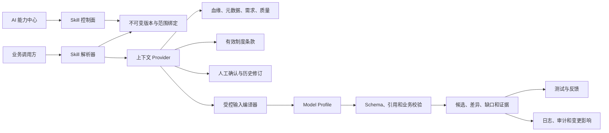

# AI Skill 配置中心与一般影响问题执行提示词

> 使用方式：本文件用于 P0 可信性修复完成或由用户明确允许并行后，推进 AI Skill 配置中心及一般影响问题。可以按阶段启动，不要一次性完成全部功能。

## 任务目标

在现有智能分析智能体平台上实现 AI Skill 配置中心，逐步把目前分散、不可配置、难以评测的 AI 行为升级为可版本化、可测试、可发布、可回滚、可审计的任务能力。同步处理血缘解释、需求生成、制度对照、Mapping、监管问答、字段匹配、质量规则、UAT 和变更影响中的一般影响问题。

必须复用现有 `ModelProfile`、`PromptTemplateVersion`、知识治理、RAG 评测、调用日志、权限、审计、需求修订和人工确认机制，不得重建第二套 AI 平台。

## 与 P0 Goal 的关系

- `P0-AI可信性与安全-GOAL提示词.md` 是当前唯一在跑的 Goal 契约，优先解决权限、运行语义、可信标签、上下文证据和反馈回归闭环。
- 本文件是 P1/一般影响问题的后续执行契约。除非用户明确允许并行，否则应在 P0 完成定义全部满足后启动。
- P0 中被证明属于 Skill 控制面、输入信封、评测门禁或发布治理的修复，应作为本文件的数据模型和接口基础复用，不重复建设。

## 开始前必须执行

1. 读取适用的 `AGENTS.md`；
2. 第一条命令执行 `git status --short`；
3. 读取 `docs/design/ai-skill-configuration-center-design.md`；
4. 读取 P0 报告，确认 P0 已完成或用户明确允许并行；
5. 核对数据库迁移 head、现有 AI 路由、前端入口、测试和未提交修改；
6. 创建或更新 `docs/handoff/ai-skill-center-implementation-report.md`；
7. 不得覆盖用户已有修改。

## 一、不可违背的边界

1. Skill 不是任意 Prompt 或文件系统插件，而是受控任务执行契约。
2. 用户可配置 Prompt、上下文范围、模型策略和测试，但不能关闭安全校验、引用规则和租户隔离。
3. 确定性事实先于模型生成，模型不得创造表、字段、血缘、监管条款和人工确认状态。
4. 已发布版本不可变；修改必须创建新草稿。
5. 回滚采用“基于旧版本创建新版本”，不能改写历史调用。
6. 不静默截断上下文。超预算必须缩小范围、阻断或由用户显式提高预算。
7. 模型无工具调用权限，不能执行 SQL、Shell、代码、存储过程和任意网络请求。
8. 不允许 Skill 绕过知识有效性、制度作用域、数据密级和项目权限。
9. 不允许模型覆盖人工确认内容、正式需求、审核状态和固定交付。
10. 不读取或输出凭据，不连接生产环境做写操作，不提交、不推送、不部署。

## 二、P1 一般影响问题

### P1-1：缺少统一的 AI Skill 控制面

#### 当前问题

- Prompt、模型、上下文和输出 Schema 分散在代码与数据中；
- Prompt 版本没有机构、项目、任务作用域；
- 没有测试、发布、差异、回滚和影响分析；
- 同一业务任务在不同服务里采用不同可靠性规则。

#### 目标

1. 新增 Skill 定义、不可变版本、范围绑定和发布事件；
2. 支持平台、机构、项目、任务四级覆盖；
3. 支持 draft、testing、pending_approval、published、deprecated、archived；
4. 支持版本差异、恢复旧版本和发布审计；
5. 支持把已发布 Skill 同步为兼容的 `PromptTemplateVersion` 快照；
6. 旧 Prompt key 调用保持兼容。

### P1-2：输入上下文过度文本化且证据不可恢复

#### 当前问题

- 某些 Mapping 上下文被拼成长文本；
- 达到固定长度后直接截断；
- 模型输出中的 `citations` 未保存；
- 页面无法解释每条结论来自哪项事实。

#### 目标

1. 建立统一输入信封；
2. 每项事实必须带稳定 `id`、来源类型、来源版本和密级；
3. 输出声明必须引用事实 ID 或制度条款 ID；
4. 超预算不截断，返回结构化缺口；
5. `context_hash`、输入契约版本和 Skill 版本进入调用日志。

### P1-3：监管知识问答仍以简单 RAG 为主

#### 当前优势

混合检索、引用校验、可信等级、冲突提示和降级已经存在。

#### 待升级

1. 查询改写和多轮问题分解；
2. 条款级召回，而不是只召回长文档片段；
3. 候选重排序和跨语言、同义词扩展；
4. 不同制度版本的作用域和效力比较；
5. 答案验证器区分事实、解释、推断和缺依据；
6. 冲突检测从简单内容哈希升级为结构化条款差异；
7. 失败时返回已获取证据，不伪装成完整回答。

### P1-4：血缘解释无法达到制度对照设计目标

#### 当前问题

当前输入偏单边事实、基础表达式和关键词制度摘要，无法稳定输出多跳来源、具体条款、实现差异、影响范围和验收建议。

#### 目标输入

- 当前边和固定脚本版本；
- 有界上下游路径；
- 表、字段、层级、业务系统和监管标准关联；
- Join、Filter、聚合、码值和表达式；
- 具体制度条款、版本、生效状态和作用域；
- 字段类型、非空、长度、枚举和精度；
- 已有质量画像；
- 历史人工确认、驳回和修订；
- 固定脚本版本之间的差异；
- 解析缺口，例如动态 SQL、星号、临时表和缺失上游。

#### 目标输出

- 业务摘要；
- 脚本事实；
- 制度要求；
- 条款级匹配、冲突、缺失实现和待确认；
- AI 解释；
- 影响范围；
- 测试场景；
- 缺口；
- 人工确认状态。

脚本现状不得自动升级为监管要求。没有制度依据时必须返回 `missing_basis`。

### P1-5：双层 Mapping 草稿的证据链和人工保护不足

#### 目标

1. 以结构化事实投影替代不受控长文本；
2. 每个模型声明可追溯到字段、脚本、元数据和知识证据；
3. 保存引用和拒绝原因；
4. 重新生成不得覆盖用户已编辑且未显式选择替换的内容；
5. 场景业务、场景技术、Source→Mart、Mart→YBT 四个任务采用一致的版本、锁和降级语义；
6. 技术字段必须来自物理白名单；
7. 生成状态同时展示确定性、Mock、真实模型、降级和待人工确认。

### P1-6：评测、反馈和观测没有覆盖全部 AI 任务

#### 目标

1. 新增通用 Skill 测试用例、测试运行和结果；
2. 区分 deterministic、mock_model、real_model、replay、human_review；
3. 指标至少包含 Schema 通过率、事实引用覆盖、引用准确性、制度冲突召回、缺口识别、人工采纳率、延迟和成本；
4. 反馈关联 Skill 版本、运行 ID、模型和输入哈希；
5. 反馈可由授权评测员转为回归样例；
6. 发布前执行确定性、安全、范围和关键业务回归；
7. 不将 Mock 成功计为真实模型成功。

### P1-7：来源推荐和字段匹配仍是确定性算法

#### 当前状态

现有推荐根据名称、代码、注释、历史和 RAG 证据评分，解释了部分候选，但未调用大模型。

#### 升级方向

1. 保留现有可解释评分作为召回；
2. 使用 Embedding 做语义候选召回；
3. 使用模型对 Top N 候选做成对重排；
4. 输入目标定义、来源注释、数据字典、历史映射和反例；
5. 输出只给候选、理由、风险和待确认字段；
6. 用户确认后才能形成正式映射。

### P1-8：变更影响仍偏 ID 列表，缺少业务解释

#### 目标

1. 脚本、表结构、监管模板和制度版本变化时自动定位受影响对象；
2. 给出变化语句、变化字段、影响路径和受影响需求；
3. 用业务语言解释为何需要复核；
4. 创建待办或复核任务，不自动修改正式版本；
5. 历史固定需求保持不可变，由用户显式创建新修订。

## 三、P2 增强问题

### P2-1：数据质量规则建议

从制度条款、字段约束、Mapping 规则、历史异常和已有质量画像生成建议规则。建议只能进入 `ai_suggested` 或草稿，必须包含证据、适用范围、严重度、预期结果和确认状态，不得自动执行真实数据查询。

### P2-2：UAT 测试项建议

从已确认脚本规则、制度要求和需求修订生成测试项。每项至少包含来源规则、预期结果、前置条件、验证证据和待审核状态。复用现有 UAT 模块，不另建测试平台，不自动查询银行真实数据。

### P2-3：监管文档与需求正文辅助

严格基于固定需求版本辅助生成背景、业务说明、差异分析和缺失信息；Excel 与 Word 必须读取同一固定版本。模型不得改变已审核正文和人工锁定字段。

### P2-4：项目智能助手

支持“查找、解释、对比、导航、创建待办”等权限感知能力。回答必须引用项目内对象，不执行任意 SQL，不跨项目检索，不自动修改业务对象。

### P2-5：模型路由、成本和缓存

按任务、密级、成本和时延选择模型；对相同上下文哈希提供受控缓存；支持本地模型、主备模型和降级模型；每次运行记录提供商、模型指纹、token、费用和失败类型。

## 四、目标架构



### 4.1 控制面

- Skill 定义；
- 版本和发布；
- 平台、机构、项目、任务绑定；
- Prompt、模型策略、上下文策略和输出 Schema；
- 测试和发布门禁；
- 版本差异和恢复；
- 权限、审计和影响分析。

### 4.2 执行面

- 解析生效版本；
- 构建结构化输入；
- 数据分类和脱敏；
- 调用模型；
- 输出校验；
- 降级和重试；
- 持久化运行和证据。

### 4.3 事实面

- 目录和资产身份；
- 数据分层与业务系统；
- 脚本版本和解析事实；
- 血缘路径；
- 需求与人工确认；
- 数据质量；
- 制度条款和知识版本。

## 五、建议数据模型

优先新增：

| 表 | 作用 |
| --- | --- |
| `ai_skill_definitions` | Skill 稳定身份 |
| `ai_skill_versions` | 不可变任务契约 |
| `ai_skill_scope_bindings` | 平台、机构、项目、任务绑定 |
| `ai_skill_test_cases` | 通用测试样例 |
| `ai_skill_test_runs` | 测试批次 |
| `ai_skill_test_results` | 逐样例结果 |
| `ai_skill_change_impacts` | 变更影响关系 |
| `ai_skill_release_events` | 发布、停用和回滚事件 |

可空扩展：

- `model_call_logs.skill_version_id`；
- `model_call_logs.context_hash`；
- `model_call_logs.input_contract_version`；
- `model_call_logs.test_run_id`；
- `ai_user_feedback.skill_version_id`；
- `ai_user_feedback.run_id`；
- `prompt_template_versions.skill_version_id`。

迁移必须向后兼容，不删除旧列，不改变旧接口默认语义。

## 六、分阶段实施

### 阶段 0：契约与兼容基线

1. 盘点所有 Prompt key 和调用方；
2. 明确 Skill key、task key 和输入契约；
3. 定义统一运行元数据和证据 ID；
4. 修复 P0 遗留的权限、Mock 透明和 Prompt 语义；
5. 建立首批黄金测试样例。

验收：旧调用不回归；统一契约有自动化测试；未授权访问被拒绝。

### 阶段 1：Skill 控制面和可视化编辑

1. 新增 Skill、版本、绑定和事件模型；
2. 实现 Skill 管理 API；
3. 实现列表、详情、编辑器、差异、测试、发布和回滚页面；
4. 接入现有 Model Profile 和审计；
5. 保留旧 Prompt 页面兼容入口。

验收：机构和项目隔离；已发布版本不可变；项目覆盖不改变机构模板；回滚可追溯。

### 阶段 2：运行时和血缘纵向贯通

1. 实现 Skill 解析器；
2. 保留旧 Prompt runtime；
3. 新运行时统一编译输入、检查密级、记录上下文哈希；
4. 完成 `lineage_edge_explanation`；
5. 增加多跳路径、具体制度条款、字段约束、质量画像、历史决定和脚本差异；
6. 完成事实、制度、AI、人工四层界面。

验收：直接写目标、多层数仓、制度冲突、缺少制度、缺失上游、动态 SQL 和模型不可用均有测试。

### 阶段 3：测试中心和发布门禁

1. 测试样例、测试运行、结果和对比；
2. 确定性、Mock、真实模型、Replay 和人工评审模式；
3. 发布门禁和执行报告；
4. 反馈转回归样例；
5. 版本差异和恢复。

验收：关键安全断言不能绕过；版本回归能阻断发布；Mock 与真实模型分开统计。

### 阶段 4：需求、制度和 Mapping 全链路

1. 把固定脚本版本、监管模板和制度快照纳入 Skill 输入；
2. 条款级制度对照；
3. 需求候选和人工内容保护；
4. 双层 Mapping 的结构化上下文、引用保存和草稿锁；
5. 重生成只产生建议差异；
6. Word 和 Excel 使用同一固定需求版本。

验收：跨脚本依赖、字段映射不明确、多目标需求、人工内容保护和版本一致性全部通过。

### 阶段 5：RAG、字段匹配和变更影响升级

1. 查询改写、重排序和条款级召回；
2. 答案验证和冲突检测；
3. Embedding＋模型字段候选重排；
4. 脚本、表结构、模板和制度变化的影响解释；
5. 受影响需求标记待复核，不自动改写。

### 阶段 6：质量、UAT 和智能助手

1. 数据质量建议；
2. UAT 测试项建议；
3. 权限感知的项目助手；
4. 模型路由、成本、缓存和可观测性；
5. 统一任务、审核和待办入口。

## 七、接口和页面要求

### 7.1 核心 API

```text
GET    /ai-skills
POST   /ai-skills
GET    /ai-skills/{skill_key}
GET    /ai-skills/{skill_key}/versions
POST   /ai-skills/{skill_key}/versions
GET    /ai-skills/{skill_key}/versions/{version}
PATCH  /ai-skills/{skill_key}/versions/{version}
POST   /ai-skills/{skill_key}/versions/{version}/validate
POST   /ai-skills/{skill_key}/versions/{version}/diff
POST   /ai-skills/{skill_key}/versions/{version}/submit
POST   /ai-skills/{skill_key}/versions/{version}/publish
POST   /ai-skills/{skill_key}/versions/{version}/restore
GET    /ai-skills/resolve
POST   /ai-skills/{skill_key}/playground
POST   /ai-skills/{skill_key}/test-runs
GET    /ai-skill-test-runs/{run_id}
GET    /ai-skill-test-runs/{run_id}/results
```

### 7.2 页面

```text
/ai-control/skills
/ai-control/skills/[skillKey]
/ai-control/skills/[skillKey]/versions/[version]/edit
/ai-control/skills/[skillKey]/playground
/ai-control/skills/[skillKey]/tests
/ai-control/skills/[skillKey]/runs
/ai-control/skills/[skillKey]/bindings
/ai-control/skills/[skillKey]/compare
```

### 7.3 UI 要求

1. 配置分区展示，不用一个 JSON 文本框承载全部能力；
2. 变量只能从白名单插入；
3. 输入预算展示明细和缺口；
4. 测试结果按样例、断言、引用和制度条款查看；
5. 每个业务页面显示实际 Skill 版本、模型和证据入口；
6. Mock、真实模型、规则和降级标签必须一致；
7. 发布前展示测试门禁和影响范围。

## 八、测试要求

至少覆盖：

1. 平台、机构、项目、任务范围隔离；
2. 草稿、测试、发布、停用、恢复和并发编辑；
3. 旧 Prompt 与旧 API 兼容；
4. 上下文预算和超预算阻断；
5. 事实和制度引用白名单；
6. 无制度依据、制度冲突和失效制度；
7. 人工内容不被重生成覆盖；
8. 脚本、制度、模板和模型变化触发复核；
9. Mock、真实模型和降级分别记录；
10. Word 和 Excel 使用同一修订版本；
11. 跨项目、跨机构访问被拒绝；
12. 浏览器完成配置、测试、发布、业务调用和反馈闭环。

## 九、完成定义

1. Skill 控制面可用且不重复现有 AI 基础设施；
2. P1 核心问题全部处理或明确拆分；
3. 血缘解释达到脚本事实、制度要求、AI 解释、人工确认四层；
4. 需求候选和 Mapping 不再静默截断、不会覆盖人工内容；
5. 评测、反馈、发布和回滚形成闭环；
6. 旧数据和旧接口保持兼容；
7. 定向测试、回归、类型检查、隔离构建和浏览器验收通过；
8. 报告明确区分确定性、Mock、真实模型和未验证项；
9. 未提交、未推送、未部署，且最终 diff 无凭据、数据库文件和构建产物。

## 十、停止和报告条件

只在以下情况停止并报告：

- P0 未完成且用户未允许并行；
- 需要修改第二套平台模型或破坏旧 API；
- 迁移不能让旧数据、旧路由和历史调用继续工作；
- 无法判断某条制度、字段或血缘的权威来源；
- 需要真实凭据、生产数据库或真实银行数据；
- 现有未提交修改与目标文件发生不可合并冲突；
- 浏览器或模型外部依赖不可用，导致关键验收无法继续。

模型或外部依赖不可用时，分别报告确定性、Mock 和真实模型状态，不得把 Mock 成功描述为真实模型验收通过。

## 结束
