# 智能分析智能体平台 · 系统使用文档

> 版本：`0020b42`（生产镜像 `ybt-backend:0020b42` / `ybt-frontend:0020b42`）
> 更新日期：2026-09-13
> 本文面向业务用户与平台管理员，说明“怎么用、点哪里、每步看什么”。
> 部署、备份、回滚等运维内容见《服务器上线操作手册》与《服务器配置说明》。

## 0. 交付信息（先看这里）

| 项目 | 值 |
| --- | --- |
| 访问地址 | **http://57008897.xyz** |
| 平台管理员账号 | **`smoke_admin`** |
| 平台管理员密码 | 见交付说明／`交付凭据.md`（**不写入代码仓库**） |
| 服务器 | `103.236.97.213`（SSH 端口 42438，运维用，日常操作不需要登录服务器） |
| 建议浏览器 | Chrome / Edge 最新版，窗口宽度 ≥ 1440px 体验最佳 |

> **首次登录后请立即修改管理员密码**。当前这个密码是端到端验收脚本使用的口令，属于“临时可交付”状态：
> 修改后请同步告知验收脚本的使用者（脚本用 `GUIDE_PASSWORD` / `SMOKE_ADMIN_PASSWORD` 之类的外置变量读取账号密码）。
> 明文口令只放在仓库外的交付凭据文件里，避免随代码一起流转。

演示/验收数据说明：库里现有的“增强验收测试项目 20260912-*”“Product 5.1 *”“UAT Product 5.1 *”等机构和账号，
都是历次端到端验收脚本创建的**脱敏演示数据**，不是真实银行业务数据，可以放心点开查看，也可以用管理员账号清理重建。

## 1. 登录

打开 http://57008897.xyz ，未登录会自动跳到登录页。

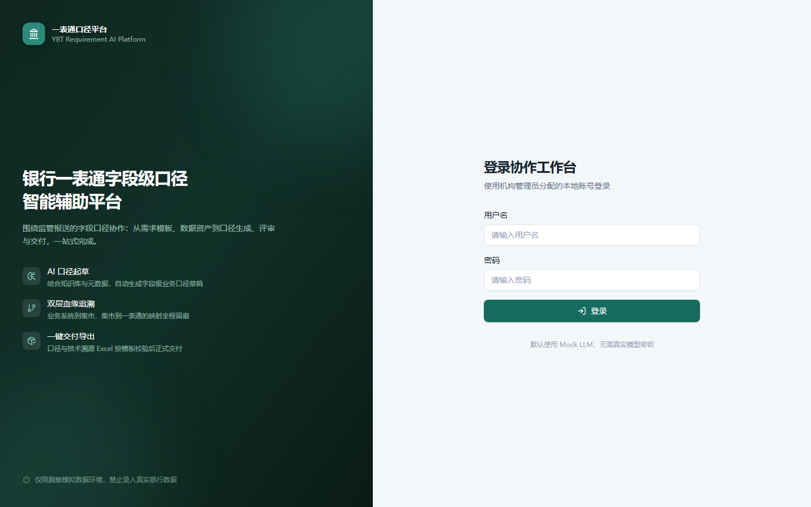

输入管理员账号密码后点击“登录”。登录成功后进入工作台，右上角显示当前机构、当前项目与登录人。
令牌有效期 15 分钟并会自动续期，长时间不动页面再操作也不会被踢出（超过 30 天未使用才需要重新登录）。

## 2. 界面总览

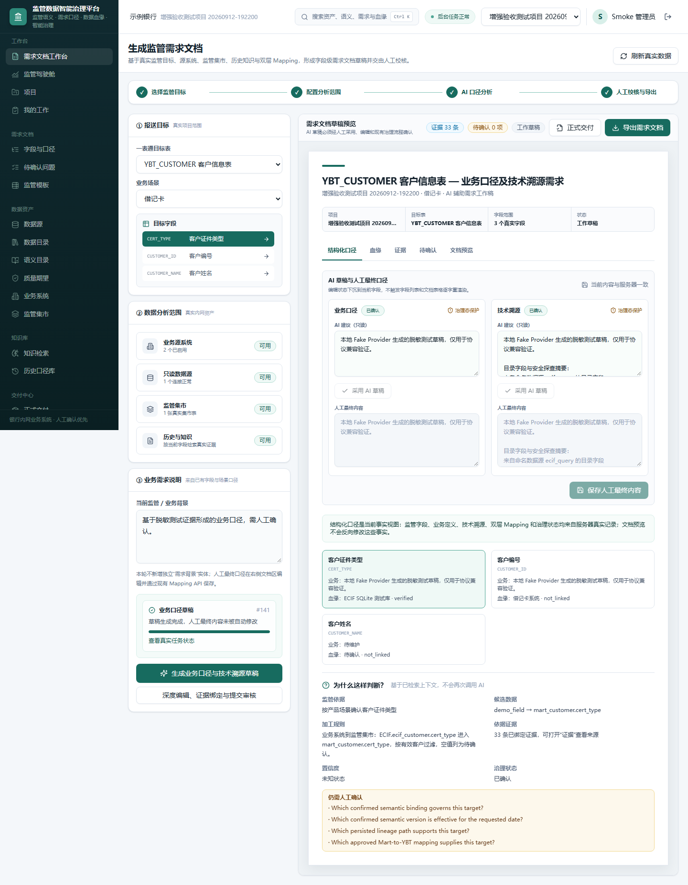

界面分为四块：

| 区域 | 作用 |
| --- | --- |
| 左侧导航 | 按“工作台 / 需求文档 / 数据资产 / 知识库 / 交付中心 / 系统管理”分组的功能入口 |
| 顶部条 | 机构名 + 当前项目下拉、全局搜索（快捷键 `Ctrl+K`）、后台任务状态灯、用户菜单（退出登录） |
| 主区域 | 当前功能页面，页面内一般遵循“先选目标 → 再配置范围 → 执行 → 查看结果”的顺序 |
| 右上角 | 当前项目切换。**大部分页面都跟随“当前项目”**，切换项目后数据随之切换 |

> 小技巧：只要链接带上 `?projectId=<项目ID>`，打开时就会自动切到那个项目；日常点击顶部下拉即可。

## 3. 角色与权限

平台按“机构 + 项目”双层授权，同一个用户在项目里可以承担不同角色：

| 角色 | 典型职责 |
| --- | --- |
| 平台管理员（机构管理员） | 建机构、建用户、配模型档案、看平台健康与审计，可进入“系统管理” |
| `business_analyst` 业务分析 | 维护字段/口径、上传知识与证据、发起 AI 起草 |
| `business_reviewer` 业务审核 | 审核业务口径与业务映射 |
| `technical_analyst` 技术分析 | 维护数据源、目录、技术血缘与 SQL 逻辑 |
| `technical_reviewer` 技术审核 | 审核技术血缘与影响分析 |
| `final_reviewer` 最终审核 | 终审并确认可交付 |
| 只读成员 | 只能查看与下载，不能修改 |

权限不满足时接口返回 403；跨机构访问他人项目返回 404（平台不暴露“该资源是否存在”）。

## 4. 主线流程：从监管目标到正式交付

### 第一步：建项目、拉成员

入口：左侧“项目” → 新建项目；项目内“成员”页维护项目角色。

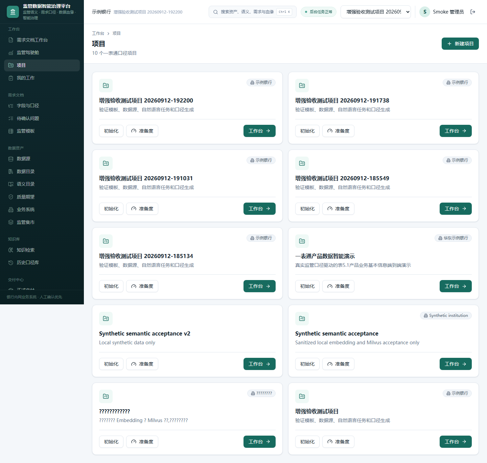

### 第二步：接入数据资产（数据源 + 目录）

入口：左侧“数据源”新增只读数据源 → 点“测试连接” → “元数据同步”；同步完成后到“数据目录”看表与字段。

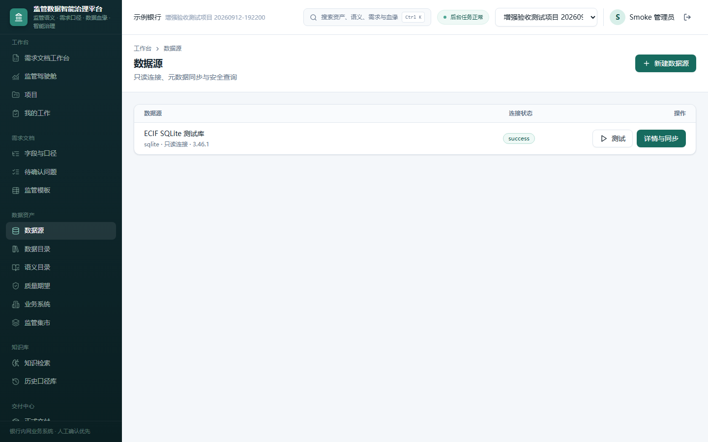

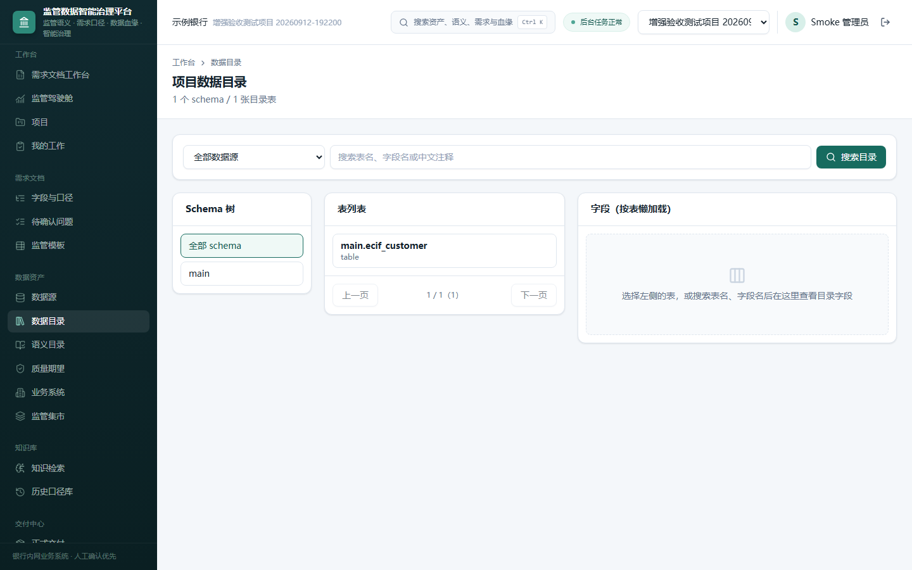

要点：**数据源必须先“元数据同步成功”，后面的目录检索、口径抽取才有依据**。
同步若显示“部分完成”，通常是数据源文件/网络在平台侧不可达（例如把本机临时文件当数据源）。

### 第三步：维护字段与口径

入口：左侧“字段与口径”。可在此挑选目标字段、维护业务定义，并查看血缘与证据完备度。

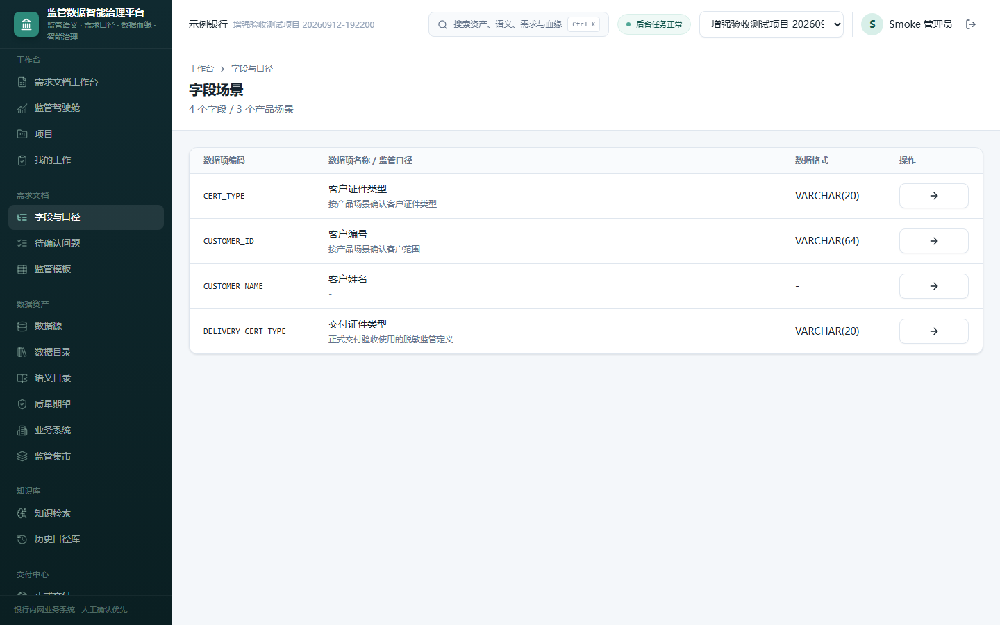

### 第四步：沉淀知识与证据

入口：左侧“知识检索”分组下的“知识文档”。支持 Excel / Word / PDF / SQL 等文件，上传后自动解析并保留
出处（sheet + 单元格、PDF 页码、SQL 行号）。

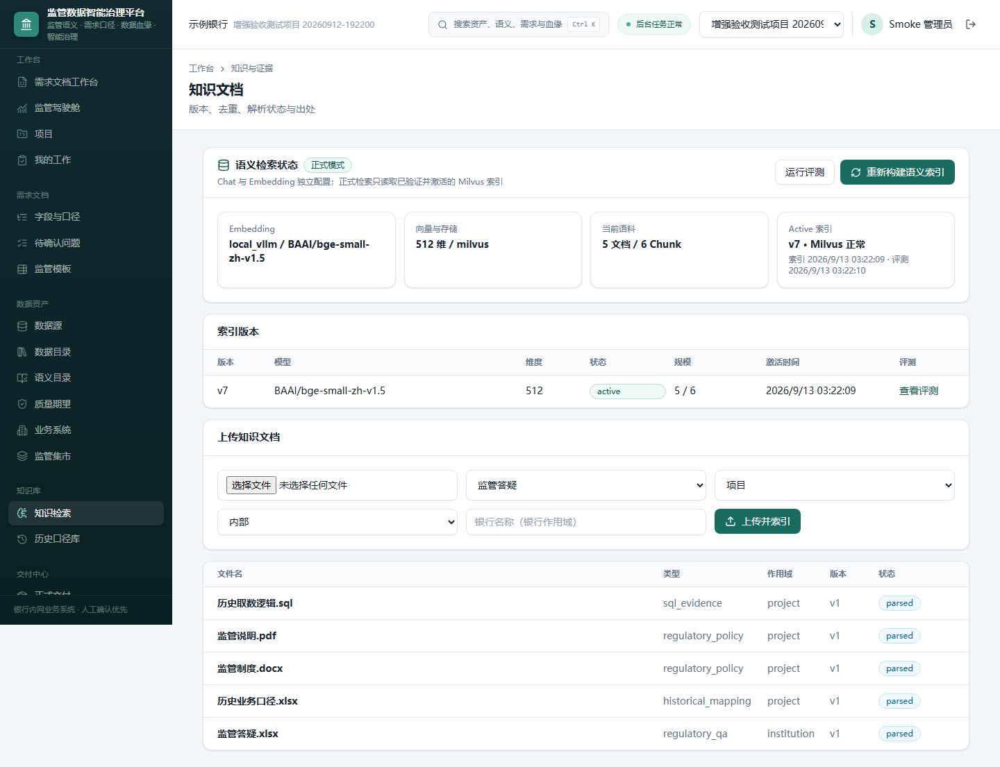

上传后如页面顶部提示索引版本变化，点 **“重新构建语义索引”** 并等后台任务跑完（页面会显示 `active` 索引版本、
文档/切片数量、Milvus 状态）。生产环境使用 Milvus 正式索引：**不重建索引，检索会提示“请先重建索引”**。

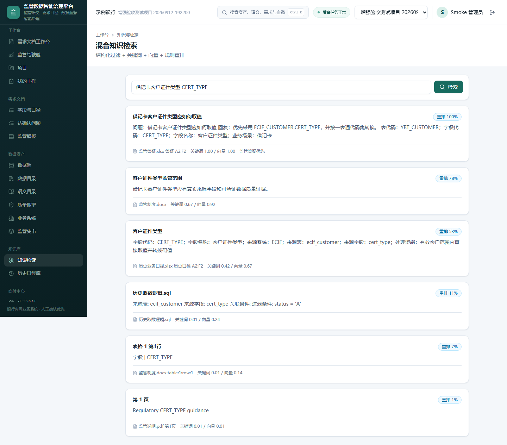

检索结果会给出综合重排分数，并标注命中的文件名与出处（例如“监管答疑.xlsx 答疑 A2:F2”）。

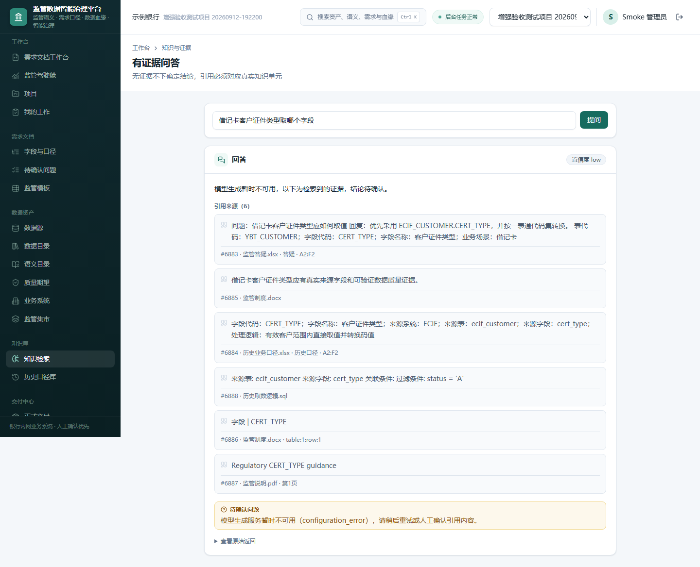

“知识问答”只依据知识库证据作答，并返回 citation；证据不足时会明确标为“待确认”，不会编造。

### 第五步：AI 口径起草（核心页面）

入口：左侧“需求文档工作台”（也可直接打开 `/workspace`）。页面自上而下是四步流程：
选监管目标 → 配分析范围 → AI 分析 → 人工校验与导出。

操作顺序：

1. 左栏选择“一表通目标表”（如 `YBT_CUSTOMER 客户信息表`）与业务场景（如“借记卡”）；
2. 选中目标字段（如 `CERT_TYPE 客户证件类型`）；
3. 确认“数据分析范围”四项资产是否“可用”（业务源系统 / 只读数据源 / 监管集市 / 历史与知识）；
4. 点 **“生成业务口径与技术溯源草稿”**，等右侧草稿区刷新；
5. 在右侧“业务口径 / 技术溯源”两栏核对 AI 草稿，可手工改写并 **“保存人工终稿”**；
6. 需要走审批时点“深度编辑、证据绑定与提交审核”，进入审核流程；
7. 确认无误后点右上角 **“导出需求文档”**（Word/Excel）或“正式交付”。

页面下方“为什么这样判断”会把监管依据、候选数据、加工规则、证据依据、置信度与治理状态逐条列出，
点击“证据”可回溯到具体知识切片；带“仍需人工确认”的黄色区必须由人工处理，**AI 不会自动放行**。

### 第六步：审核与治理

入口：左侧“待确认问题”“我的工作”“审核任务”。

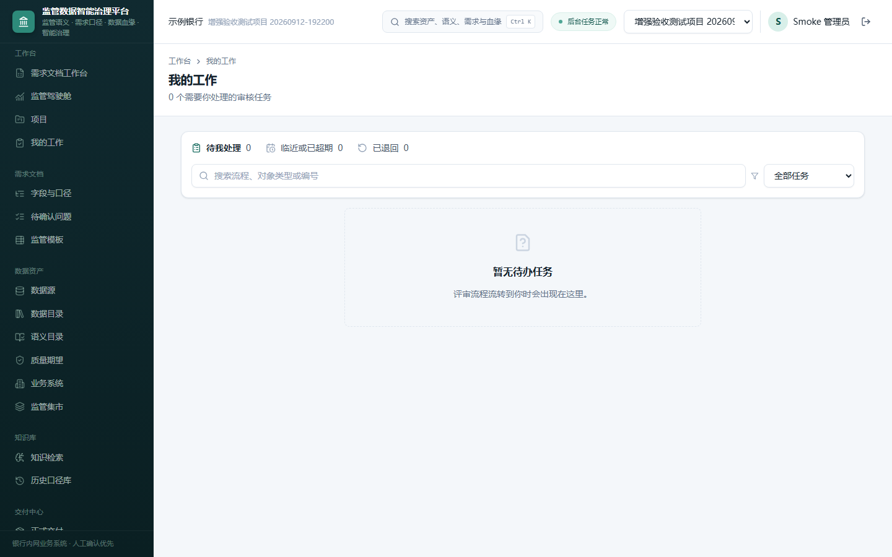

按业务审核 → 技术审核 → 终审的顺序流转；每次决策都会写入审计日志（系统管理 → 平台健康/审计可查），
并通过站内通知提醒相关人。

### 第七步：血缘与影响分析

入口：左侧“数据资产 → …”分组中的血缘相关页面（`/lineage`）。

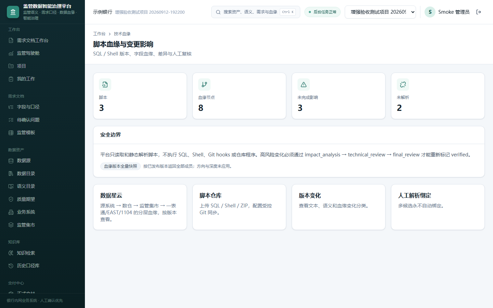

上传 SQL 脚本后可看到脚本版本差异、血缘节点/边、变更影响分类（字段新增/删除、过滤条件变化、关联变化等）。
变更后需要人工确认影响范围，未审核的影响会出现在项目看板上。

### 第八步：生成正式交付包

入口：左侧“交付成果 → 正式交付工作台”（`/deliverables`）。

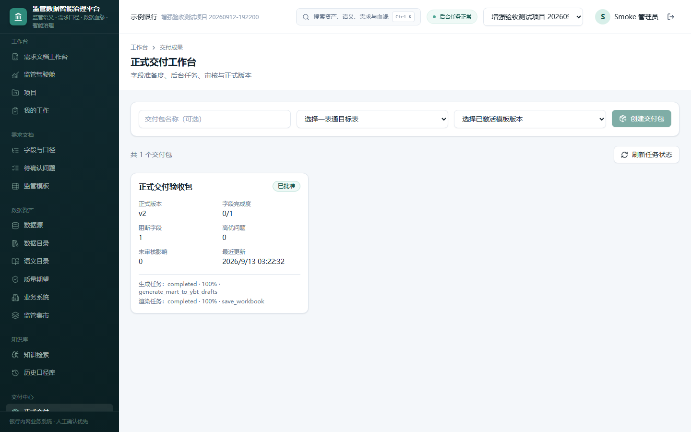

选择“一表通目标表 + 已激活模板版本”后点“创建交付包”，系统会依次执行生成任务与渲染任务；
完成后可下载正式 Excel（包含结构化口径、技术溯源、血缘、变更影响等多个 sheet）与版本对比。
交付包有版本号与批准状态，重复批准是幂等的（不会重复产生版本）。

### 第九步：UAT 验收

入口：左侧“交付中心 → UAT”。

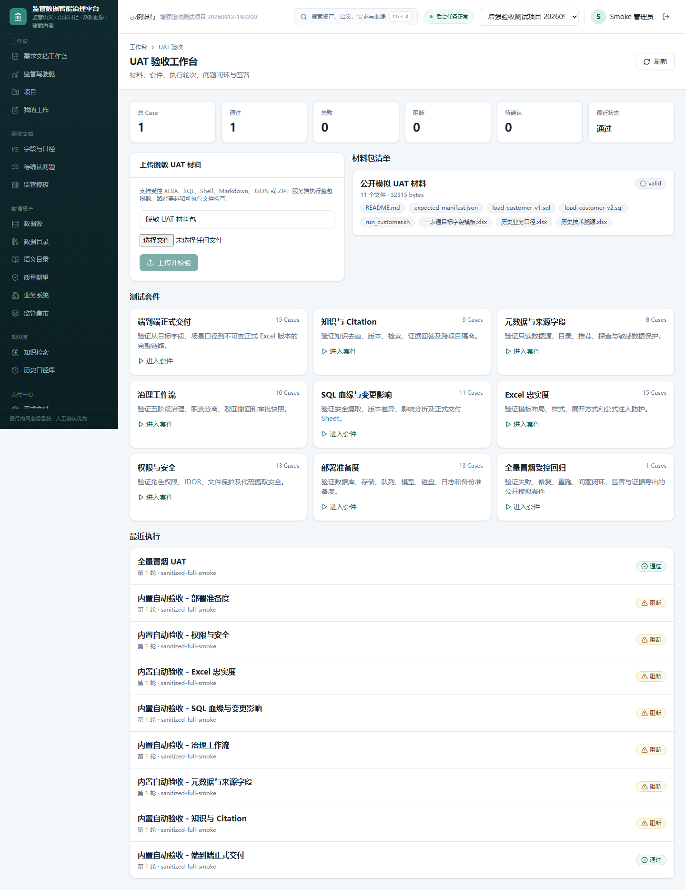

内置 8 个套件 / 94 条用例（自动 60 / 人工 7 / 混合 27）。流程是：上传 UAT 包 → 校验 → 执行 → 提 finding →
复验 → 签核 4 份 → 下载报告与证据包。首轮失败、整改后补验通过是设计允许的正常路径。

### 旁路：后台任务

入口：顶部“后台任务”。长耗时操作（知识解析、索引重建、元数据同步、交付渲染、UAT 执行）都在这里排队执行。

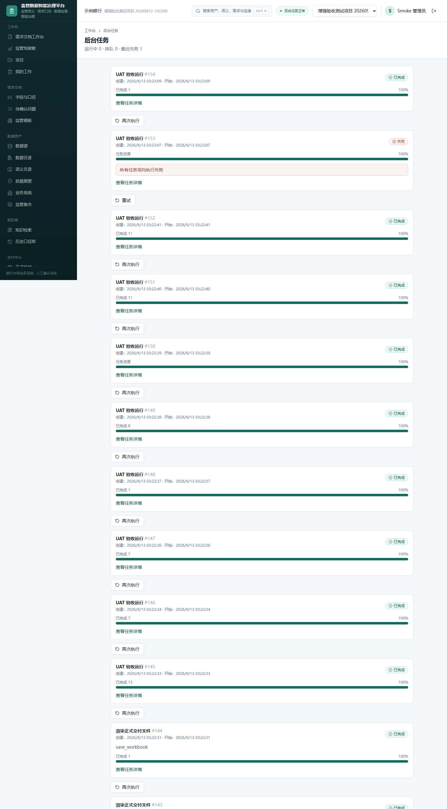

任务失败会记录错误原因，可重试；同类型任务有幂等键，重复提交不会重复执行。

## 5. 系统管理（管理员）

入口：左侧“系统管理”，分组为“管理概览 / 机构管理 / 用户管理 / 角色与权限 / 平台健康”。

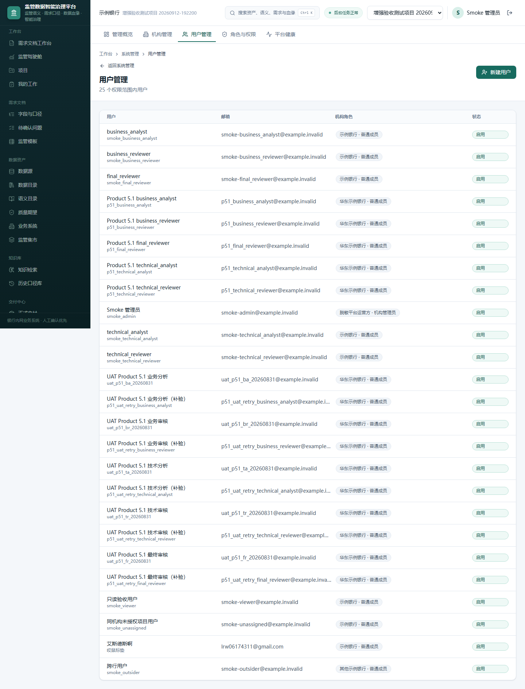

| 页面 | 用途 |
| --- | --- |
| 机构管理 | 新建/查看机构（银行、平台运营方等） |
| 用户管理 | 新建用户、分配机构与机构角色、启停账号 |
| 角色与权限 | 查看角色定义与权限项 |
| 平台健康 | 依赖健康状态、审计与运行信息 |

### 模型与运行环境

入口：`/model-profiles`（AI 运行环境）。

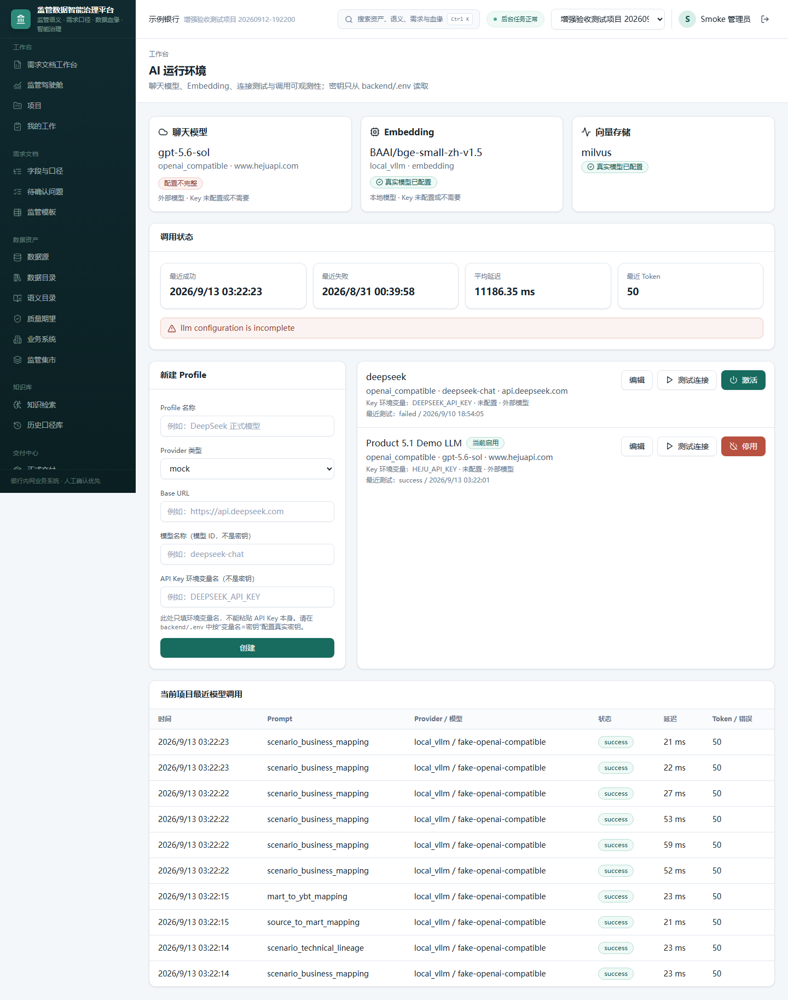

这里能看到聊天模型、Embedding、向量存储三项的实际配置与连通性，以及当前项目最近的模型调用记录。
**当前生产状态需要注意**：

- 聊天模型档案指向外部服务，服务器访问该地址受限，且档案引用的密钥变量名与服务器 `.env` 不一致 → 显示“配置不完整”；
  所以本次上线验收是用“协议级假提供方”跑通的，页面里 `local_vllm / fake-openai-compatible` 的调用记录就是那次验收留下的。
- 库里已经预置了 `deepseek` 档案（`api.deepseek.com` / `deepseek-chat`，未启用，缺 `DEEPSEEK_API_KEY`）。
  要启用真实模型，按《服务器配置说明》§3.5.1 的做法 A/B 配置密钥并激活档案，然后在本页点“测试连接”确认。

平台健康页（`/admin/system-health`）会聚合数据库、Redis、任务队列、向量库、Embedding、模型配置与磁盘状态：

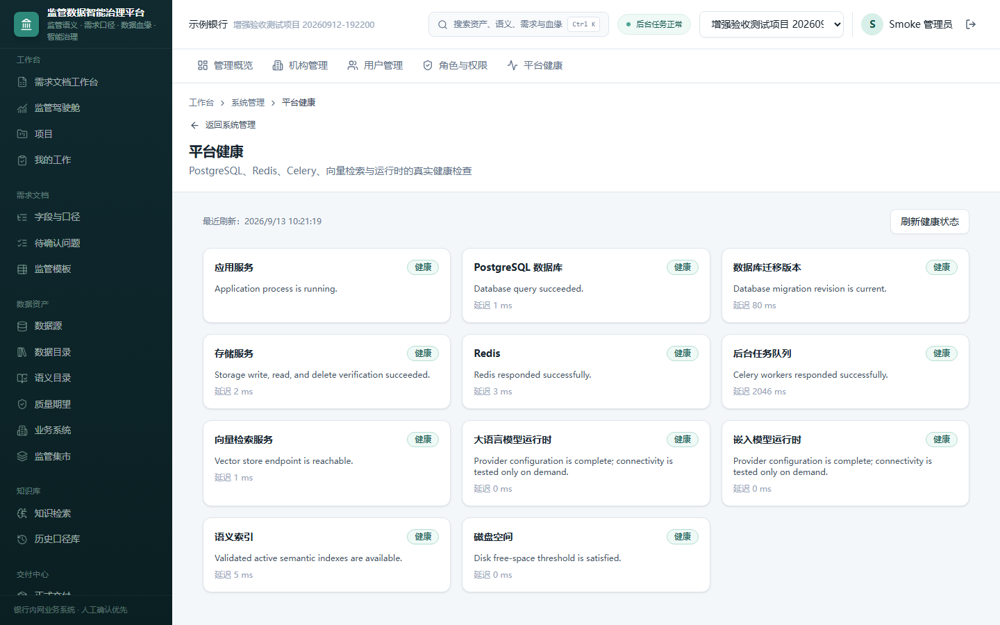

## 6. 常见问题

| 现象 | 原因与处理 |
| --- | --- |
| 打开页面一直转圈 / 401 | 令牌过期：重新登录一次；仍不行清一下浏览器缓存 |
| 检索报“请先重建索引” | 生产使用 Milvus 正式索引，上传/删改知识后要到“知识文档”点“重新构建语义索引” |
| 目录检索不到字段 | 数据源“元数据同步”未成功或只“部分完成”，先修数据源连通性再同步 |
| 交付包生成卡住 | 到“后台任务”看具体任务状态与错误；Worker 异常时联系运维 |
| 生成的草稿内容很空/像占位文本 | 说明当前聊天模型未接入真实大模型（见第 5 节），生成走的是降级/假提供方链路 |
| 重复建机构或用户报“资源状态冲突” | 编码/用户名/邮箱已存在，属正常校验（HTTP 409），换个唯一值即可 |
| 想换项目看数据 | 用顶部项目下拉切换，或带 `?projectId=<ID>` 打开 |

## 7. 已知边界（如实说明）

1. **真实大模型尚未接入**：`www.hejuapi.com` 在服务器上不可达，且模型档案引用的密钥变量名与 `.env` 不一致；
   DeepSeek 档案已建好但缺密钥。这一步需要你提供可用密钥或确认切换方案。
2. 本次上线验收覆盖了后端全部主链路与 8 个内置 UAT 套件，**前端只做了 HTTP 层与页面级验证**（本文截图即真实页面），
   未做多浏览器兼容性与压力/并发测试。
3. 服务器提示内核更新待重启，尚未重启（不影响当前业务）。
4. 库里的演示数据来自验收脚本，正式投产后建议清理或改用真实机构与用户。
